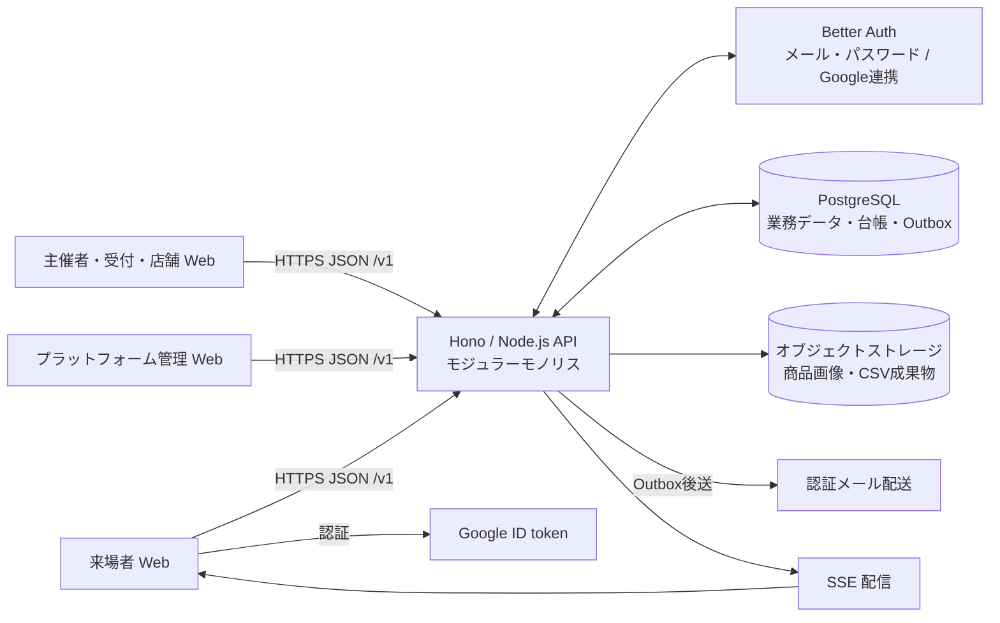
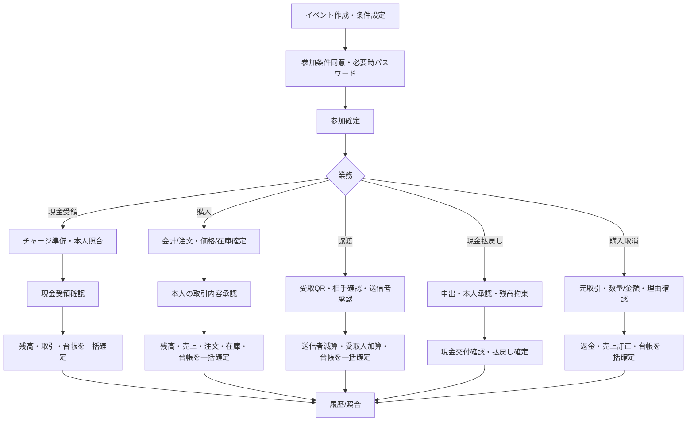
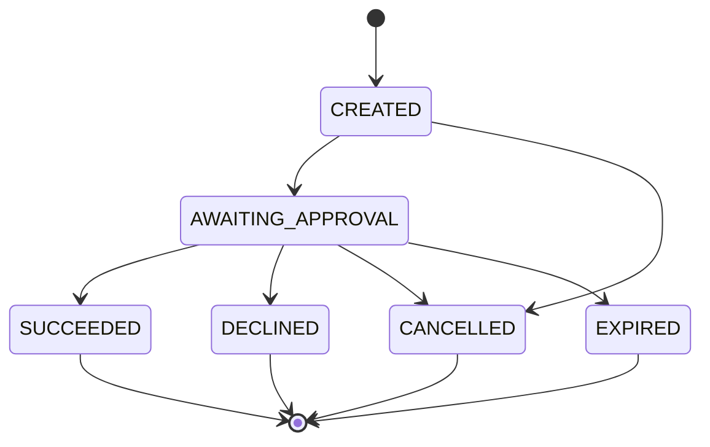
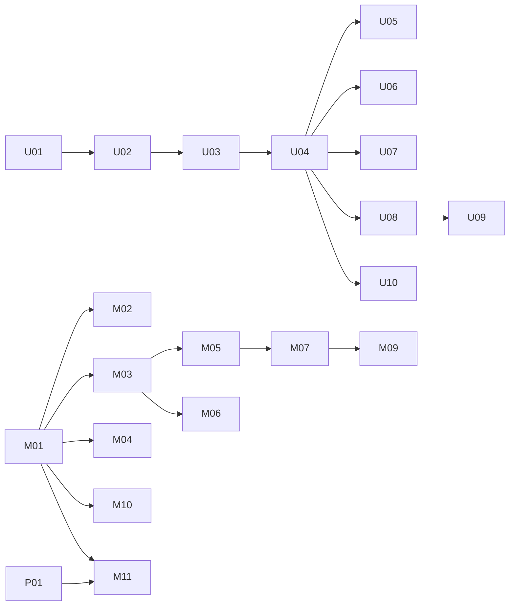
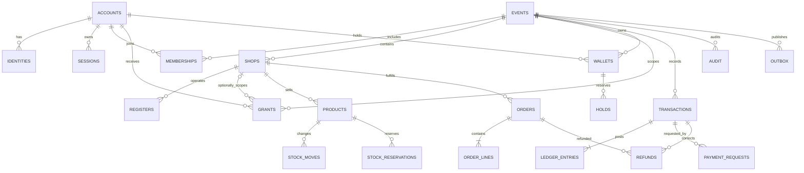

# FesPay 基本設計書

## 1. 文書概要

| 項目 | 内容 |
|---|---|
| 文書ID | EPP-DES-001 |
| 対象要件 | [EPP-REQ-001 v0.1（統合基準版）](../requirements/event_payment_requirements_integrated_v0.1.md) |
| 版 | v0.1 |
| 状態 | 基本設計案。実装・性能・法務・セキュリティ試験の完了を示さない |
| 担当 | 未割当 |
| レビュー者 | 未割当 |
| 更新日 | 2026-09-29 |
| 正本 | 本ファイル1冊 |

本書はEPP-REQ-001を唯一の仕様根拠とする。要件で確定・補完採用された仕様は設計へ反映し、複数の設計方法があり要件だけで決まらない事項は「未決事項」に残す。基本設計を作成しただけでは実金銭運用可能、法的適合、性能達成、WCAG適合、監査済みとは扱わない（GOV-01～04、LEG-01～02、REL-01～02）。

## 2. システム概要

FesPayは、イベント単位の利用者残高、店舗決済、利用者間譲渡、現金チャージ・払戻しの記録、商品・在庫・注文、売上・現金照合を提供するWebシステムである。プラットフォームは台帳と記録を提供し、現金の受領・保管・送金は代行しない。イベントごとの現金管理と出店者への実際の精算は主催者の責務である（ROL-01、RPT-06）。

金銭移動の正本はイベント内の取引・複式台帳であり、画面残高やCSVではない。残高金額に業務上限はない。一方、1取引のAPI/DB表現は1～30桁の円整数で、技術限界超過時は取引全体を拒否する。これは業務上限を設けるものではない（MNY-01/02、WAL-01～04）。

## 3. 適用範囲・前提・制約

### 3.1 初期対象

- 共通アカウント、メール＋パスワード、Googleログイン、イベント作成・掲載・参加。
- 主催者・運営・店舗管理者・レジ担当・来場者・プラットフォーム管理者の業務。
- 現金チャージ、QR決済A/B/C、利用者間譲渡、未使用残高の現金払戻し、購入取消・部分返金。
- 商品・数量在庫、店頭注文・モバイル注文、受付・受渡し、売上・現金照合・CSV。
- クラウド上の正本を用いる通常Web利用。会場Wi-Fi・携帯回線のいずれも利用可能とする（SCP-01、NET-01）。

### 3.2 初期対象外

LAN内完結、会場サーバー、会場接続元制限、NFC、ネイティブアプリ、銀行送金連携、換算・特典・無料配布、イベント間残高移動、スマホなし代替、オフライン決済後同期、原材料在庫、後払い、複数店舗一括会計、外部カードチャージ、上限設定画面、自由な画面編集・独自ワークフローを設けない（SCP-01～03、CFG-06、CHGLOG-01）。

### 3.3 目標と実証の区別

規模（1イベント参加者10,000人、店舗100、同時稼働レジ200、全体同時3イベント）、応答・復旧・性能値は受入目標であり実測結果ではない。G1～G5の公開ゲートが完了しない場合、実金銭を扱わず、模擬残高であることを明示したデモに限定する（GOV-02/03、REL-01/02）。

## 4. 用語・ID体系

| 用語 | 意味 |
|---|---|
| 利用可能残高 | 利用者が支払い・譲渡に使えるイベント内残高 |
| 払戻し拘束 | 払戻し申出後、現金交付結果が確定するまで他用途に使えない金額 |
| 返金専用額 | 販売終了・失効後の購入取消返金。支払い・譲渡・失効に使わない額 |
| 成立取引 | DBトランザクションで取引・台帳・関連業務データが永続化された取引 |
| 結果不明 | クライアントが確定応答を得ておらず、成立・未成立を照会で解決する状態 |
| 公開識別子 | QR等に含める推測困難な用途限定識別子。金額や恒久的権限を含めない |
| 要件ID | EPP-REQ-001内のID。本書の各章および末尾のトレーサビリティに記載 |

IDは不変の内部IDを主キーとする。外部に連番の個人IDを露出しない。注文の読み上げ用番号は内部IDと分ける。金額はJSONで10進数字文字列、時刻はUTC ISO 8601、画面表示は日本時間（Asia/Tokyo）を基本とする（API-01、DAT-03、ORD-03、RPT-02）。

## 5. システム全体構成

本番形態はクラウド上のReact + Vite、Hono + Node.js、Better Auth、PostgreSQL、SSE + Outbox、オブジェクトストレージによるモジュラーモノリスとする（ARC-01～04）。サービス間の詳細配置・クラウド製品・メール事業者・オブジェクトストレージ製品は未決。ブラウザからDBへ直接接続・残高更新させない。認証メール配送とGoogle認証以外の外部サービスを追加しない（API-05）。

論理モジュールは認証、イベント・参加、権限・招待、店舗・設定、チャージ・現金、決済・QR、台帳・残高、譲渡・払戻し・返金、商品・在庫・注文、レポート・CSV、監査・Outboxとする。分割配置や別サービス化は要件から決まらないため採用しない。

## 6. 利用者・ロール・権限設計

認可の判定キーは「アカウント＋イベント＋必要に応じ店舗＋操作」。各APIが認証主体の有効性、イベント参加/所属、店舗所属、付与済み操作権限、イベント・店舗・サービス停止状態をDB上の最新状態で検証する。画面上の非表示は認可の代替にならない（ROL-03、SEC-07、DAT-01）。

| 主体 | 許可範囲（要件に明示されたもの） | 制約 |
|---|---|---|
| 来場者 | 本人の残高・履歴・注文閲覧、本人支払承認、譲渡、払戻し申出 | 他者の金銭操作を承認不可。本人の確認済みメールが金銭操作条件 |
| イベント主催者 | 自イベント設定、運営・店舗管理者任命、イベント全体停止、現金管理、集計、公開前提確認 | 任意残高編集・本人支払代行不可。所有者は1アカウント |
| 運営担当 | 招待で付与されたイベント操作。権限に応じチャージ・払戻し・照合等 | 有効範囲内のみ。金銭操作時に追加認証 |
| 店舗管理者 | 自店舗管理、レジ担当の招待・権限変更・解除、店舗停止 | 自分が保有する範囲かつ主催者許可範囲。主催者が禁止した設定を変更不可 |
| レジ担当 | 割当店舗の会計、担当権限に含まれる操作 | 招待権限なし。売上総額・価格変更・返金は付与がない限り閲覧/実行不可 |
| 返金権限者 | 担当イベント/店舗の元取引に対する理由付き返金 | 返金対象・累計・数量をAPIで再検証。追加認証必須 |
| プラットフォーム管理者 | サービス・アカウント・イベント停止、監査・特権調査 | 業務権限を自己追加不可。通常画面で残高編集不可。理由・操作者・対象・時刻記録 |

兼務時はイベント、店舗、業務モードを常時表示し、未完了の会計・チャージ・払戻し中は切替を止める。解除後の新規操作は拒否し、既成立取引は保持する。権限解除と同時に進行中の操作が競合した場合はDB内の権限再検証と確定の順序で決め、古い画面/セッションを信頼しない（ROL-04～06）。

招待は発行後72時間有効、256ビット相当の乱数トークンを保存時ハッシュ化し、1回限りとする（QRトークンとは別仕様）。発行時・受諾時の両方で権限を再計算する。未受諾招待は発行者の権限縮小・解除・交代で失効。受諾済みレジ担当は管理者交代時に維持し、旧管理者との親子依存を作らない。所有者交代には旧所有者再認証と新所有者受諾を要する（STF-01～05）。

## 7. 業務フロー設計

イベント参加のみで残高や業務権限を与えない。すべての確定系フローで、確定直前に認証・権限・イベント状態/受付期間・停止フラグ・対象・額・残高・在庫・承認内容版・冪等キーをサーバーで再検証する（JOIN-01、EVT-04、TX-02）。

## 8. 状態・ライフサイクル設計

全状態更新は許可遷移をAPIの業務ロジックとDB制約/条件付き更新で制限する。取引成立後の書換えはしない。状態名・意味は要件の表現を維持する。

### 8.1 イベント状態

| 状態 | 意味・許可操作 | 禁止/遷移条件 |
|---|---|---|
| 下書き | 主催者設定・担当準備 | 一般参加・金銭取引不可 |
| 公開・準備中 | 案内、参加、商品閲覧。設定済み期間中の事前チャージ | 販売開始前決済不可 |
| 開催中 | 各受付期間内のチャージ、決済、譲渡、注文、返金 | 各機能設定・停止・受付期間を別途確認 |
| 販売終了 | 受渡し、取消、払戻し、集計 | 新規決済・注文・譲渡不可 |
| 精算中 | 未解決取引、現金差異、払戻し、残高処理 | 通常営業の新規処理を行わない |
| 完了 | 履歴・CSV・問い合わせ | 未解決残高、現金処理、注文、返金があれば遷移不可 |

`下書き → 公開・準備中 → 開催中 → 販売終了 → 精算中 → 完了` を基本順序とする。完了後の正当な訂正は理由付き再開処理。受付期間は開始含み・終了含まず、サーバー時刻で判定する。公開/掲載/参加方式はイベント状態とは別属性（EVT-02～06）。

### 8.2 店舗・緊急停止

店舗の営業可否は店舗の受付停止、主催者の機能設定（禁止/任意/必須）、イベント状態、イベント全体/店舗/サービス緊急停止を別々に保持する。新規注文停止時は新規決済・予約を拒否し、未承認要求を取消して在庫拘束を解放する。既成立注文の受渡し・返金・履歴は可能。緊急停止中も結果照会、監査、安全な商品引渡し、既に現金交付済みの払戻し完了記録を許可する。返金等の価値移動は主催者の精算専用再開後のみ（CFG-01～06）。

### 8.3 支払要求・取引

SUCCEEDEDから未成立へ戻さない。要求内容変更は旧要求取消し後に新要求。QR期限（読取用）と関連付け済み要求期限（承認用）は別。未承認B方式は1利用者・1イベントにつき1件、Aは最初に関連付いた1利用者のみ（TX-01、PAY-A01/02、PAY-B01～06）。

### 8.4 払戻し・注文・返金・予約

| 対象 | 状態/意味と遷移 | 禁止・例外 |
|---|---|---|
| 現金払戻し | PREPARED → HELD → CASH_HANDING → PAID。未交付確認後のみCANCELLED。結果不明はINVESTIGATING | HELD 5分警告、30分で調査一覧。自動解除なし。CASH_HANDING以降は必ず調査対象 |
| 注文 | 支払待ち → 受付済み → 調理・準備中 → 受取待ち → 受取完了。未払い取消・期限切れは取消 | 支払済取消は返金完了/調査と対応。部分返金でも残りの提供継続 |
| 返金 | 元決済参照の別取引。要求 → 成立または未完了調査 | 元決済を変更しない。累計額・数量超過を拒否。30日案内後も未交付返金を消去しない |
| 在庫予約 | 支払確認開始で明細全体を120秒予約。成立で在庫・予約を同量減算。取消/期限切れで予約解放 | 期限切れ解放と支払成立は同じ行の排他制御。部分予約不可 |
| 招待 | 発行済 → 受諾済/拒否/失効 | 72時間・1回限り。権限変更時に受諾条件を再検証 |
| アカウント | 有効/停止、退会申請・精算保留・削除/分離 | 停止とイベント内利用停止は別。残高等未解決なら通常削除保留 |
| 緊急停止 | サービス/イベント/店舗各スコープに独立した停止フラグ | 解除権限は該当する運営主体。通常期間設定で停止状態を迂回しない |

返金と提供状態、支払状態は分離する。未受取を理由に自動完了/失効しない。イベント完了は未処理の拘束・返金・注文・現金差異を残したまま許可しない（CSH-01～06、REF-01～04、ORD-01～06、INV-01/02、STF-01～05、ACC-01～06、SEC-04/05、EVT-06）。

## 9. 機能一覧

| 機能 | 主な要件 |
|---|---|
| アカウント・認証・回復 | ACC-01～06、SEC-01～03 |
| イベント・参加・運営委任 | EVT-01～06、JOIN-01～03、STF-01～05 |
| 権限・利用停止・緊急停止 | ROL-01～06、CFG-01～06、SEC-04～06 |
| QR決済A/B/C・現金チャージ | PAY-A01/02、PAY-B01～06、PAY-C01/02、CHG-01～06、QR-01～03 |
| 譲渡・現金払戻し・返金 | TRF-01～06、CSH-01～07、REF-01～04、EXP-01～03 |
| 台帳・残高・冪等・監査 | MNY-01/02、WAL-01～04、TX-01～06、LED-01～06 |
| 店舗・商品・在庫・注文 | PRD-01/02、INV-01～05、ORD-01～06 |
| レポート・CSV・現金照合 | RPT-01～06、CSH-07、EXP-01～03 |
| Web UI・通信・アクセシビリティ | UI-01～08、NET-01～04、PWA-01/02 |
| セキュリティ・個人情報・運用 | SEC-01～11、PRV-01～05、OPS-01～06、ARC-01～04 |

## 10. 機能基本設計

### 10.1 イベント・参加・設定

作成時は非掲載、参加方式の初期選択は公開。必須項目と期間整合を検証し、公開操作時に確認を要求する。掲載/非掲載と公開/パスワード参加を独立管理し、4組合せを許可する。検索は名前・開催日・会場、開催開始日時＋ID昇順、20件/ページ、最大100件。非掲載を一般一覧・検索・サイトマップに含めずnoindex、公開キャッシュは掲載解除から60秒以内に失効させる。参加条件同意・必要時パスワード検証後、account_id＋event_id一意で参加を作成する。パスワードは8～64文字でハッシュ保存、再表示しない。誤入力はアカウント＋イベントで10回/10分、超過後15分待機（EVT-01～03、JOIN-01～03）。

イベント初期値は、チャージ/支払/譲渡期間が開催期間、譲渡OFF、未使用残高払戻しON（開催終了2時間後まで）、自動失効なし。店舗機能は要件表の既定値に従う。初回チャージ後、利用者に不利益な払戻しOFF・期間短縮・失効新設/前倒しを拒否する。有利変更は理由と版を記録する（EVT-04/05）。

### 10.2 チャージ

来場者U06の受付用QRは60秒・イベント・用途限定。受付M04は本人、イベント、表示名、短い照合番号を確認し、準備IDを作成。現金受領確認の後に、同額を利用可能残高へ加算し、取引、台帳、現金受領記録、監査を一トランザクションで確定する。現金とDBは原子的にできないため、受領事実を別途記録し、結果不明時は同じ要求IDを照会し、差異案件へ関連付ける。キー同一・内容同一は既存結果を返し、内容相違は409（CHG-01～06）。

### 10.3 決済

全方式共通で店員/利用者にイベント・店舗・金額・明細を表示し、本人が明示承認する。確定直前に認可、イベント参加/停止、期間、残高、価格版、在庫、要求内容を再検証。残高、店舗売上勘定、注文、在庫、台帳、監査、OutboxをPostgreSQLの同一トランザクションで確定し、コミット後に成功を応答する（PAY-B01～06、PAY-A01/02、PAY-C01/02、TX-01～06）。

| 方式 | 基本動作 |
|---|---|
| A | 店舗が会計を作り店舗QRを120秒表示。利用者が読取・本人確認後に明細承認。最初の関連付け利用者のみ可 |
| B | 店舗が利用者の60秒支払QRを読み、本人宛要求を作成。利用者の承認後に確定。関連要求の承認期限120秒 |
| C | 固定QRは店舗案内のランダムURL。金額入力なら利用者入力・店員着金照合。商品選択は双方許可のモバイル注文時のみ |

### 10.4 譲渡・払戻し・購入返金

譲渡はイベント内の有効参加者同士、主催者が許可した場合のみ。受取QRは120秒・1回・1譲渡。送信者の相手照合と明示承認を必須にし、送信側減算と受取側加算を同一トランザクションで行う。成立後の送信者単独取消不可（TRF-01～06）。

現金払戻しは本人申出・承認時に利用可能額から拘束へ振替え、1人/イベント同時1件。担当が現金を渡す前に拘束を確認し、交付済み確認で拘束減算と払戻し台帳を確定する。現金を渡したか不明なら拘束を維持して調査。期限後も未処理申出を消去しない（CSH-01～07）。

購入返金は元成立決済を指定し、元本人・イベントへ戻す。金額入力会計は金額、商品会計は元単価×数量。返金額累計は元決済以下、商品数量は購入数以下。並行返金も元取引行のロックと条件付き更新で排他。販売終了/失効後は返金専用額へ戻し、支払い・譲渡・失効に使わない。返金確定と在庫復元は分離し、再販売可能確認・理由に基づく在庫移動のみ追加（REF-01～04）。

### 10.5 商品・在庫・注文

商品は店舗所属。名称1～100文字、説明0～1,000文字、正の円価格、販売状態、表示順、在庫管理有無、任意画像。会計作成時に価格・名称等の版を明細へ固定し、承認開始後の見積を120秒固定する。商品在庫はon_hand、reserved、available=on_hand-reservedで表す。注文の全明細を一括予約し、1件でも不足なら全拒否。予約と期限切れ/成立は同じ在庫行をロックする。カートは利用者・イベント・店舗につき確認中1件、1注文50明細、商品数量1～999。これらは金額上限ではない（PRD-01/02、INV-01～05）。

店員入力・モバイル注文は共通注文モデル。モバイル注文には主催者と店舗双方の許可が必要で、前払い成立時に自動受付。支払状態・提供状態・返金状態を別管理。受取番号に加えて本人画面/QR/照合コードを確認し、受取確定は権限者がサーバーで行う。商品不足・閉店・中止時は支払済み未提供一覧を作り、提供/返金の選択を記録する（ORD-01～06）。

## 11. 画面一覧

画面は要件定義にあるU01～U10、M01～M11、P01に限定する。画面内ダイアログは独立した画面IDにせず、仕様上必要な確認ステップとして扱う。

| ID・名称 | 対象/目的 | 主な表示・入力・操作 | 主なAPI | エラー・状態/権限制御 | 要件 |
|---|---|---|---|---|---|
| U01 認証・復旧 | 未認証/本人の認証管理 | 登録、メール確認、メール/Googleログイン、再設定、認証連携、全端末ログアウト | A01–A04 | 資格情報不一致、期限切れ、最終認証手段解除拒否。本人認証 | ACC-01～06、SEC-02/03 |
| U02 一覧・案内 | 公開イベント探索 | 検索、開催日時、会場、主催者、参加・払戻し条件、問合せ先 | E01 | 非掲載は一覧に返さない。公開状態のみ | EVT-02/03 |
| U03 参加・条件同意 | イベント参加 | 条件版、同意、必要時の参加パスワード、既参加判定、元店舗へ戻る | E02–E03 | 誤入力頻度制限。参加だけで残高/業務権限なし | JOIN-01～03 |
| U04 イベントホーム | 参加者のイベント業務入口 | イベント、利用可能/拘束/返金専用額、確認時刻、支払/チャージ/譲渡/注文導線 | E04、W01、T01 | 参加者本人のイベント口座だけ。オフライン時は最終確認時刻表示 | WAL-01/02、NET-02 |
| U05 支払・QR読取 | 来場者支払 | B QR表示、A/C読取、店舗/金額/明細、承認/拒否、期限、確認中 | Q01–Q04、T02–T03 | 403/409/期限/残高不足/結果不明。許可形式QRのみ | PAY-*、QR-*、TX-* |
| U06 チャージ・現金払戻し | 来場者本人の申出・照会 | 受付用QR、受付場所/時間、金額、拘束/交付状態、取引ID | C01–C04、H01–H03 | 期限・受付外・結果確認中。本人の履歴に限定 | CHG-*、CSH-* |
| U07 譲渡 | 送信者 | 受取QR、表示名/照合番号、金額、送信後残高、取消不可案内 | F01–F03 | 同一イベント・有効参加・譲渡ON・残高を再検証 | TRF-* |
| U08 商品・カート | 参加者の商品購入 | 店舗別商品、価格、売切れ、合計、支払前予約/価格確認 | P01–P03、O01 | 店舗機能/受付状態と在庫。本人のカート | PRD-*、INV-* |
| U09 注文・受取 | 注文した本人 | 注文番号、明細、提供状況、受取画面、取消/返金状態 | O02–O04 | 本人注文のみ。部分返金と提供状況を分離 | ORD-*、REF-* |
| U10 履歴・問合せ | 本人 | 取引検索、額/日時/相手/元取引/状態、問合せ追跡ID | W02、T04、O05 | 50件/ページ、最大100件まで追加読込。本人のみ | UI-01、ROL-02 |
| M01 主催者ホーム | 主催者 | 自イベント、状態、純売上、残高総額、現金未解決、停止店舗 | E04、R01 | 自イベントのみ。権限・追加認証 | ROL-01、RPT-01 |
| M02 イベント設定 | 主催者 | 掲載/参加、期間、機能、譲渡/払戻し/失効、条件版 | E05–E07 | 不利益変更・矛盾設定拒否。金額上限/LAN項目なし | EVT-01～06、CFG-01 |
| M03 店舗・運営管理 | 主催者/付与権限管理者 | 店舗作成、管理者任命、権限、所有者交代、招待/解除監査 | S01–S04、E08 | 主催者許可と付与者権限の共通範囲 | STF-*、ROL-* |
| M04 受付 | チャージ/払戻し権限者 | QR照合、現金受領、払戻し、結果確認中、交付不明、業務認証 | C01–C05、H01–H04 | 追加認証。イベント/店舗/操作認可、担当モード固定 | CHG-*、CSH-*、ROL-04 |
| M05 スマホレジ | 店舗レジ担当 | 店舗/モード、金額/商品、B読取、A表示、C固定QR、成立結果/履歴 | Q01–Q04、T02–T03 | 店舗所属・操作範囲。売上総額・返金等は権限外非表示/API拒否 | PAY-*、UI-06 |
| M06 商品・在庫 | 店舗管理者/許可担当 | 商品/価格版、売切れ、在庫移動理由、予約/販売可能数、画像 | P01–P04 | 店舗所属、画像検査。予約数未満の減算拒否 | PRD-*、INV-*、SEC-09 |
| M07 注文一覧 | 店舗担当 | 経路、状態、受付番号、経過、商品、提供/受取、返金導線 | O02–O04 | 自店舗注文だけ。更新競合は最新状態を表示 | ORD-*、UI-07 |
| M08 スタッフ管理 | 店舗管理者 | 自店舗レジ担当招待、72時間、範囲、解除/引継ぎ | S01–S04 | レジ担当の招待不可。権限再検証・監査 | STF-01～05 |
| M09 取消・返金 | 主催者/返金権限者 | 元取引、返金済額/数量、上限残、理由、在庫再販可否 | T05、R02 | 元取引/店舗認可、追加認証、累計上限、冪等 | REF-01～04 |
| M10 売上・現金照合 | 主催者/範囲内の運営 | 期間/店舗/担当集計、実査/差異理由、CSV、取引検索 | R01–R04、C05 | 店舗/イベント範囲。CSV毎回権限確認 | RPT-*、CSH-04/07 |
| M11 運用・完了判定 | 主催者 | 通信、停止/精算専用再開、未完了一覧、終了前条件 | E09、H04、R05 | 完了条件に未解決残高/現金/注文/返金ゼロが必要 | CFG-03/04、EVT-06、OPS-* |
| P01 プラットフォーム管理 | プラットフォーム管理者 | 全体障害/通報、サービス停止、監査、公開ゲート/責任者記録 | A05、E10、R05 | 特権操作に追加認証・理由記録。自己業務権限追加不可 | ROL-05、LEG-*、REL-* |

全画面はイベント/店舗を切替える際にカート・未成立要求の扱いを明示し、別店舗へ持ち込まない。レジ/来場者UIは縦向き320 CSS px、200%拡大、44×44 CSS px操作領域を基準とする。WCAG 2.2 AAは評価基準であり適合済みではない（UI-01～08）。

## 12. 画面遷移設計

店舗QR/リンクから未参加者が入った場合もU01→U03の認証・参加条件を経て、元店舗へ復帰する。画面遷移は業務操作を確定しない。最終承認は画面上のイベント・店舗・相手・円額・明細を提示する（JOIN-01、UI-02）。

## 13. 画面基本設計

11章の画面表を画面仕様の正本とする。本章は画面横断の入力・出力規約を定める。

- 金額は全桁・円単位を表示し、確認画面で省略表記を使わない。正数整数のみ受け付ける。境界超過は明示エラーとし、自動丸め・分割・部分確定をしない（MNY-01/02、UI-02）。
- 入力不正は対象欄と修正方法、認証/認可失敗は適切なログインまたは問い合わせ先、期限切れは再取得導線、409は現在状態と安全な照会先を示す（UI-03、API-02）。
- 更新・SSE通知時に選択中注文や編集中額を勝手に置換しない。競合時は最新状態との差を表示する。金銭処理中/結果確認中/現金交付中の強制再読込を禁止する（UI-07、PWA-02）。
- QR成功音・QR読取・画面上のスクリーンショットを決済成功と表示しない。成立はサーバーの取引ID・永続化結果で確認する（QR-02/03、TX-01/03）。
- 発表用模擬データは別環境・明示的DEMO表示。現金受領記録や実利用者メールを利用しない（UI-08、ARC-03）。

## 14. API基本設計

### 14.1 共通契約

HTTPS JSON、`/v1`配下。認証はBetter AuthのセッションCookieを基本とし、更新系ではCSRF検証、許可OriginのみCORS。Cookie属性、OAuthコールバック詳細は環境/ライブラリ設定確定時にOpenAPI・ADRへ記録する。IDは推測困難な不変ID、金額は10進文字列、時刻はUTC ISO 8601、一覧はカーソル方式。共通エラーは`code, message, request_id, retryable, current_state_or_query`。状態コードは401/403/404/409/422/429/503の要件区分に従う。金銭系切断ではHTTPエラーのみで未成立と断定せず、同一冪等キーで照会する（API-01～05、TX-03～06）。

### 14.2 API一覧（論理案）

下表のパスとIDは画面・業務へ対応させるための基本設計案であり、OpenAPIの最終パス名・分割は後続設計で確定する。要件から一意に定まらない項目は未決事項に記録した。すべての金銭変更APIは認証、明示的操作権限、冪等キー必須。成功応答はDBコミット後。

| API ID | Method / URL（案） | 認証・認可 | 主入力→出力 | 主なエラー/状態 | 冪等/Tx/DB | 要件 |
|---|---|---|---|---|---|---|
| A01 | POST `/v1/auth/email/*` | 未認証/本人 | メール資格情報→認証状態 | 401/422/429 | 認証基盤管理 | ACC-01/06 |
| A02 | POST `/v1/auth/google/*` | Google応答検証 | ID token→サービスセッション | 401/409/429 | sub一意、検証後確定 | ACC-02/03 |
| A03 | POST `/v1/auth/identities`、DELETE同パス | 本人再認証＋追加先認証 | provider→連携状態 | 401/409/422 | identity一意、最後の手段解除拒否 | ACC-03/04 |
| A04 | POST `/v1/auth/sessions/revoke` | 本人 | 対象範囲→失効結果 | 401/422 | セッション失効 | ACC-05/06 |
| A05 | GET/POST `/v1/admin/services/{id}/status` | 特権＋MFA | 停止状態、理由→監査ID | 403/409/422 | 状態版条件更新＋監査 | ROL-05、CFG-03/04 |
| E01 | GET `/v1/events` | 公開一覧 | 検索/カーソル→掲載中公開イベント | 422/429 | 読取 | EVT-02/03 |
| E02 | POST `/v1/events`、GET/PATCH `/v1/events/{event}` | 有効アカウント/主催者 | 設定→イベント/版 | 403/409/422 | 版付き設定 | EVT-01～06 |
| E03 | POST `/v1/events/{event}/participations` | 本人 | 条件版/同意/必要時PW→参加 | 401/403/409/422/429 | `(account,event)`一意 | JOIN-01～03 |
| E04 | GET `/v1/events/{event}/dashboard` | イベント権限 | 範囲→状態・集計 | 403/404 | 読取 | ROL-03、RPT-01 |
| E05 | PATCH `/v1/events/{event}/settings` | 主催者＋必要時MFA | 機能/受付設定→版 | 403/409/422 | 版条件更新 | EVT-04/05、CFG-01 |
| E06 | POST `/v1/events/{event}/suspensions`、DELETE同 | 該当停止権限＋MFA | scope/reason→停止状態 | 403/409/422 | 状態更新＋監査 | CFG-02～04 |
| E07 | POST `/v1/events/{event}/completion` | 主催者＋MFA | 完了要求→判定 | 403/409未解決 | 完了条件照合Tx | EVT-06 |
| E08 | POST `/v1/events/{event}/shops`、PATCH `/shops/{shop}` | 主催者/店舗管理者 | 店舗設定→店舗版 | 403/409/422 | イベント複合所属 | CFG-05/06、STF-04 |
| E09 | POST `/v1/events/{event}/settlement-resume` | 主催者＋MFA | 理由→精算専用状態 | 403/409/422 | 監査と一括 | CFG-04 |
| E10 | GET/POST `/v1/admin/publication-gates` | プラットフォーム管理者 | 証跡・責任者状態→ゲート記録 | 403/422 | 監査記録 | GOV-02/03、LEG-01/02、REL-01 |
| S01 | POST `/v1/events/{event}/invitations` | 主催者/店舗管理者の範囲内 | 対象メール/ロール→招待ID/URL | 403/409/422/429 | token一意・ハッシュ保存 | STF-01～05 |
| S02 | POST `/v1/invitations/{token}/accept` | 招待先認証 | token→所属/権限 | 401/403/409/期限切れ | 1回限り、所属Tx | STF-01～05 |
| S03 | PATCH/DELETE `/v1/events/{event}/grants/{grant}` | 付与範囲＋MFA | 権限版/理由→新状態 | 403/409 | version条件＋audit | ROL-03/06、STF-* |
| S04 | POST `/v1/events/{event}/ownership-transfer` | 旧所有者再認証/新所有者受諾 | 新所有者→保留/確定 | 403/409/期限 | 所有者一意・監査Tx | STF-04/05 |
| Q01 | POST `/v1/events/{event}/payment-requests` | 店舗会計権限 | 店舗/方式/額/明細/版→要求ID | 403/409/422/在庫不足 | キー必須、要求Tx/必要予約 | PAY-*、INV-* |
| Q02 | POST `/v1/events/{event}/payment-requests/{id}/approve` | 要求本人＋必要時MFA方針 | 内容版/承認→取引状態 | 403/409/残高不足/期限 | 同一キー、全関連DB Tx | PAY-*、TX-* |
| Q03 | POST `/v1/qr-tokens`、POST `/v1/qr-tokens/resolve` | 用途別本人/業務権限 | purpose/event→短命トークン/対象 | 403/404/期限/再利用 | トークン消費一意 | CHG-01、PAY-*、TRF-02 |
| Q04 | GET `/v1/payment-requests/{id}` | 本人/関連店舗権限 | 요구ID→状態/結果 | 403/404 | 読取専用 | TX-03～05、PAY-B05 |
| T01 | GET `/v1/events/{event}/wallet/summary` | 本人 | →利用可能/拘束/返金専用/確認時刻 | 403/404 | 台帳整合済み参照 | WAL-01～03 |
| T02 | POST `/v1/events/{event}/transactions` | 本人/対象店舗権限 | 操作/額/参照/キー→transaction/result | 401/403/409/422/429/503 | 冪等必須、全金銭Tx | TX-01～06、LED-01～04 |
| T03 | GET `/v1/events/{event}/transactions/{id}` | 本人または現在の関連権限 | →確定状態/額/時刻 | 403/404 | 読取専用 | ROL-06、TX-05 |
| T04 | GET `/v1/events/{event}/transactions` | 本人/運営範囲 | filter/cursor→履歴 | 403/422 | 読取 | ROL-02/06、DAT-02 |
| T05 | POST `/v1/events/{event}/transactions/{id}/corrections` | 主催者/専用権限＋MFA | 理由/額→訂正取引 | 403/409/422 | 元取引ロック、同Tx | CHG-05/06、CSH-05、LED-01 |
| C01 | POST `/v1/events/{event}/charges` | 受付チャージ権限＋MFA | QR/額/準備ID/キー→チャージ結果 | 403/409/422/結果不明 | 一意キー・台帳一括Tx | CHG-01～04 |
| C02 | GET `/v1/events/{event}/cash-operations/{id}` | 本人担当/主催者 | →処理・現金確認状態 | 403/404 | 読取 | CHG-03/04、CSH-02/06 |
| C03 | POST `/v1/events/{event}/charges/{id}/corrections` | 主催者/訂正権限＋MFA | 元額/理由/額→訂正結果 | 403/409/422 | 元額残・残高同Tx | CHG-05/06 |
| C04 | POST `/v1/events/{event}/cash-cases` | 現金調査権限＋MFA | 種別/理由/現金事実→案件 | 403/409/422 | 監査一括 | CHG-04/06、CSH-06/07 |
| C05 | POST `/v1/events/{event}/cash-reconciliations` | 主催者/指定担当 | 理論/実査/差異/理由→照合結果 | 403/409/422 | 監査・差異Tx | SEC-06、CSH-07 |
| F01 | POST `/v1/events/{event}/transfers` | 本人/譲渡ON | 受取トークン/額/承認/キー→取引 | 403/409/422/残高不足 | 両口座ロック・二重仕訳防止Tx | TRF-01～06 |
| F02 | GET `/v1/events/{event}/transfer-requests/{id}` | 当事者/現在の運営範囲 | →結果 | 403/404 | 読取 | TRF-03/04 |
| F03 | POST `/v1/events/{event}/recipient-tokens` | 本人参加者 | →120秒受取QR | 403/429 | 1回消費トークン | TRF-02 |
| H01 | POST `/v1/events/{event}/refund-requests` | 本人/受付範囲 | 金額/QR→PREPARED/HELD | 403/409/422 | wallet行ロック、拘束一括Tx | CSH-01/04 |
| H02 | POST `/v1/events/{event}/refund-requests/{id}/cash-handing` | 払戻し担当＋MFA | 取引ID→CASH_HANDING | 403/409 | 状態条件更新＋audit | CSH-02/03 |
| H03 | POST `/v1/events/{event}/refund-requests/{id}/complete` | 払戻し担当＋MFA | PAID/CANCELLED/調査理由→結果 | 403/409/422 | 同キー、拘束/台帳/現金記録Tx | CSH-02～06 |
| H04 | POST `/v1/events/{event}/refund-requests/{id}/handover` | 主催者/管理者＋MFA | 新担当/理由→引継ぎ | 403/409 | 監査付きTx | CSH-03 |
| P01 | GET/POST `/v1/events/{event}/products` | 商品管理権限 | 商品/版→商品 | 403/409/422 | イベント店舗FK | PRD-01/02 |
| P02 | POST `/v1/events/{event}/inventory-moves` | 店舗在庫権限 | 商品/数量/理由→移動 | 403/409/422 | inventory行ロック | INV-04 |
| P03 | POST `/v1/events/{event}/carts`、PATCH `/carts/{id}` | 本人/参加/店舗機能 | 明細→見積/予約 | 403/409/422/在庫不足 | 予約全明細Tx | INV-01～03 |
| P04 | POST `/v1/events/{event}/products/{id}/image` | 店舗商品管理 | 画像→検証済みファイルキー | 403/413/415/422 | ファイル所有者確認 | SEC-09、DAT-03 |
| O01 | POST `/v1/events/{event}/orders` | 本人/注文可能店舗 | cart/経路/承認→注文/取引 | 403/409/在庫不足 | 決済/注文/在庫/台帳同Tx | ORD-01/02 |
| O02 | GET `/v1/events/{event}/orders`、GET `/orders/{id}` | 本人/自店舗担当 | filter/cursor→注文 | 403/404 | 読取 | ORD-03、ROL-03 |
| O03 | PATCH `/v1/events/{event}/orders/{id}/fulfillment` | 自店舗受渡し権限 | 版/遷移/受取照合→状態 | 403/409/422 | 状態条件Tx | ORD-04/05 |
| O04 | POST `/v1/events/{event}/orders/{id}/cancel` | 権限に応じ本人申出/店舗 | 理由→取消/返金要否 | 403/409 | 返金APIへ関連 | ORD-02/06 |
| O05 | GET `/v1/events/{event}/orders/{id}/receipt-token` | 本人 | →短命受取情報 | 403/404/期限 | 受取時消費一意 | ORD-04/05 |
| R01 | GET `/v1/events/{event}/reports/sales` | 集計権限 | 期間/店舗→集計 | 403/422 | snapshot読取 | RPT-01/02 |
| R02 | POST `/v1/events/{event}/refunds` | 主催者/店舗返金権限＋MFA | 元取引/額・数量/理由→返金結果 | 403/409/422 | 元決済ロック・同Tx | REF-01～04 |
| R03 | POST `/v1/events/{event}/exports` | CSV権限 | 条件→snapshot/export ID | 403/409/422 | 同一snapshot条件保存 | RPT-03～05 |
| R04 | GET `/v1/exports/{id}`、GET `/download` | 生成者/現在権限 | →状態/ファイル | 403/404/期限 | 毎回認可、24h削除 | RPT-04/05 |
| R05 | GET `/v1/events/{event}/reconciliation` | 主催者/監査権限 | →台帳/現金/差異 | 403/409不一致 | 読取/案件作成 | LED-06、OPS-01、CSH-07 |
| W01 | GET `/v1/events/{event}/wallet` | 本人 | →3区分残高 | 403/404 | 正本参照 | WAL-01/02 |
| W02 | GET `/v1/events/{event}/wallet/activity` | 本人/運営範囲 | カーソル→履歴 | 403/422 | 読取 | ROL-02、UI-01 |
| N01 | GET `/v1/events/{event}/stream` | 認証済み/イベント所属 | Last-Event-ID→更新通知 | 401/403/再接続 | データを含めすぎず正本再取得 | TX-04、NET-04 |

各エンドポイントでIDが指定されても、親イベント・店舗・アカウントの組合せを複合キー/FKと認可で検証する。404は要件上秘匿すべき不存在/権限外対象にも使用できる。APIの最終スキーマ、ページカーソル形式、認証Cookie名、上記案にない検索条件はOpenAPI確定事項（ROL-03、DAT-01、API-01～04）。

## 15. 認証・認可設計

Better Authを認証基準とし、メール＋パスワードまたはGoogleのいずれかで利用可能。メール確認済みの有効アカウントに金銭・主催者操作を限定。Google ID tokenはサーバー側で署名、issuer、audience、有効期限、nonce等を検証し、`sub`を外部IDとする。メール一致でアカウントを暗黙統合しない。連携は既存アカウント再認証＋追加先認証。パスワードは15～128文字、可逆保存せずscryptまたは同等以上のハッシュ。メール確認リンク24時間、再設定30分、セッション無操作7日・絶対30日を適用（ACC-01～06）。

重要操作はTOTP追加認証必須（一般来場者は任意）。30秒周期・前後1周期許容、コード再利用禁止、5回/5分失敗で15分停止。回復コード10個・一回限り・ハッシュ保存、再発行で旧コード失効。OAuth利用者も業務API側で追加認証完了を確認する。共有アカウント不可（SEC-01～06）。

認可は各API呼出しで最新のイベント所属・店舗所属・grant・停止・操作を確認する。DB更新時は認可対象行と業務行を同じトランザクション内で再確認し、解除との競合を直列化する。別イベント・店舗・利用者IDの差替え、解除済みgrant、古いセッションによる操作を拒否する（ROL-03/06、SEC-07）。

## 16. QR・トークン設計

QR値は推測困難な乱数を使う用途限定トークンへの参照。要件はビット長を指定していないため具体値は未決とする。生値は発行時に一度返し、保存は検証用ハッシュ。通常ログ・解析・CSVへ出さない。DB側にイベント、用途、対象主体、発行/失効時刻、消費状態を保存し、用途ごとの一意消費とイベント一致を制約する（CHG-01、PAY-B02、TRF-02、SEC-10）。

| 用途 | 有効期間/回数 | QRに含めないもの |
|---|---|---|
| 受付チャージ | 60秒、チャージ対象特定 | 金額、支払/譲渡/ログイン権限 |
| 支払用B | 表示QR 60秒。関連付け後要求120秒 | 金額、残高、永久秘密 |
| 店舗会計A | 120秒、最初の利用者へ関連付け | 他会計への使い回し権限 |
| 固定店舗C | 公開識別URL。失効時に識別子再発行 | 金額、残高、承認 |
| 譲渡受取 | 120秒、1譲渡 | 恒久的な移動権限 |
| 注文受取 | 受取時消費。照合コード8桁 | 署名なし連番のみの本人証明 |

読取後は自サービス内の許可形式・用途だけを受け入れ、任意URLへ自動遷移しない。カメラはHTTPSと利用者許可が必要。スクリーンショット、読取成功、通知到着は成立証明にならず、サーバー取引結果を照会する（QR-01～03、ORD-04）。

## 17. 金銭・残高・台帳設計

### 17.1 金額・勘定

API金額は正規表現上1～30桁の10進整数文字列。計算はBigInt相当、DBは`NUMERIC(30,0)`相当。指数・符号・小数・NaN/Infinity・0円決済を拒否。途中合計が表現範囲を超えたら全件拒否し、自動分割・丸めをしない。保有/チャージ/決済/譲渡/日次譲渡の業務上限は設けない（MNY-01/02）。

イベント境界内で勘定を閉じ、最低限、利用者利用可能残高、払戻し拘束、返金専用額、店舗売上、現金受領/交付・差異を区別する。プラットフォームが現金を保管・送金する勘定とはしない。各成立取引は取引ヘッダと2本以上の符号付き台帳明細を持ち、1取引内合計0、event_id一致。譲渡は利用者間の振替で、イベント総発行残高/売上を増やさない（LED-01/02/05、ROL-01）。

### 17.2 残高・拘束・取引不変条件

- 台帳が成立金額移動の正本。残高参照行を持つ場合は台帳と同一トランザクションで更新し、再計算照合可能とする。
- 利用可能額・払戻し拘束・返金専用額・販売可能在庫は非負。拘束額と返金専用額は支払可能額に加算しない。
- 返金累計は元決済以下、明細返金数量は購入数量以下。利用者残高を負にしない。
- 支払済み注文・在庫販売・台帳の分離成功を許さない。金銭・注文・在庫を1 DB Txで確定。
- 成立済み取引/台帳は通常UPDATE/DELETE禁止。訂正は理由付き別取引と関連記録。
- 5分ごとの増分照合、日次全件照合、イベント完了前全件照合。不一致時はイベントの新規金銭処理を停止し、原因確認・訂正・再照合後に再開。

### 17.3 同時実行・冪等性

金銭要求は主体＋イベント＋操作＋冪等キーを必須とする。`(主体, event_id, operation, key)`一意制約と内容ハッシュを保存。同一キー・同一内容は保存済み結果、同一キー・異内容は409。取引/キーは台帳保存期間中保持する。残高・在庫・元決済・要求を同じDBトランザクションでロック/条件付き更新。一貫したロック順はイベント制御・認可、口座、商品、要求。競合/デッドロック/直列化失敗は同一キーでサーバー内最大3回再試行（TX-03/04/06、LED-03/04）。

### 17.4 現金照合

現金はDB残高と別の現物管理対象。理論額＝開始釣銭＋記録受領－記録交付－記録返却等。釣銭投入を利用者チャージに混ぜない。担当者別の受領・交付・未解決数を日次実査と突合し、差異理由・実査時刻・担当を記録。差異ゼロかつ未解決案件ゼロを完了条件とする（SEC-06、CHG-04、CSH-07）。

## 18. 決済設計

決済開始時に金額/商品版を固定し、承認画面にイベント、店舗、処理種別、全額、明細を表示。操作主体の明示承認を要求する。確定時に認可・本人/イベント/店舗状態・受付期間・金額/価格版・残高・在庫・停止状態を再検証。承認画面提示後に会計内容が変わったら要求を取消し、別要求を作る（TX-02、PAY-B06、PRD-02）。

商品注文では在庫予約（120秒）を先に取引要求へ紐付け、確定時に支払・売上・注文・予約消費・台帳を原子的に反映する。通知/メールはOutboxをコミット後に処理し、通知失敗で成立決済を取消さない。OutboxイベントIDで重複通知を抑止（TX-04、INV-01/02）。

## 19. チャージ・払戻し・返金設計

チャージ、払戻し、返金の詳細は10.2、10.4に従う。共通して画面上の連打抑止は補助に留め、DB一意制約・冪等性・行ロック・トランザクションで二重処理を防ぐ。

| 処理 | 資金上の更新 | 不明時の扱い |
|---|---|---|
| 現金チャージ | 現金受領記録、利用者残高増、台帳 | 現金受領事実を保持。同じ取引ID照会。未成立確定前に返却/再受領/別ID発行をしない |
| 未使用払戻し | 利用可能額→拘束、交付確定時に拘束を減らし現金交付/台帳 | 拘束維持、再交付/自動解除せず調査 |
| 購入返金 | 元本人・元イベントの利用可能額または返金専用額、店舗売上訂正、返金台帳 | 未完了返金申出を保持し、返金済み表示/イベント完了を禁止 |
| 誤チャージ訂正 | 残高が十分な場合だけ相殺・台帳を一括確定 | 不足時は巻戻し/負残高にせず元取引保持、現金差異案件で調査 |

## 20. 譲渡設計

同一イベントの有効参加者間だけ。送信者本人が受取表示名・照合番号・イベント・金額を確認して承認する。全額一括で送信者減算/受取人加算するため、中間成功なし。受取人の払戻し資格は譲渡元金額によって分けない。譲渡無効化後は新規確定を拒否するが成立済み残高は維持する。送信者単独取消や主催者による本人承認なしの利用者間移動は提供しない（TRF-01～06）。

## 21. 商品・在庫設計

商品・価格・在庫属性は店舗境界に所属し、商品画像キーにも同じイベント・店舗所有者を適用する。商品は取引参照がある場合物理削除せず停止/アーカイブ。価格編集で過去明細を変更しない（PRD-01/02、INV-04、DAT-01/03）。

在庫確保・注文確定・期限切れ解放を同一予約行と商品在庫行の排他制御で実装。販売可能数はキャッシュの値で決済を認可しない。最後の1個の競合は最大1件成立。材料・セット構成の自動分解は対象外（INV-01～05）。

## 22. 注文・モバイルオーダー設計

店員入力とモバイル経路は共通注文ヘッダ/明細を使用し、経路属性を保存。前払い成立時に注文受付。店舗側の事前承認待ちを設けない。公開呼出画面に氏名・メール・残高を表示しない。受取時は8桁照合コード失敗5回/注文/10分で保留し本人画面を再確認。本人通知はWeb Push必須ではなく画面照会を正本とする（ORD-01～06）。

## 23. データモデル設計

以下は要件データ群に基づく論理エンティティ。実テーブル統合・分割は後続DDLで定義し、未確定部分は24章に記録する。

論理群：accounts、identities、sessions/TOTP、events、policies/版履歴、memberships、grants、invitations、shops、registers、wallets、holds、transactions、idempotency、ledger_entries、payment_requests、tokens、cash_operations/cases、products、stock_moves、stock_reservations、orders/order_lines、refunds/refund_lines、audit、outbox、exports。accounts等の要件語をそのまま物理テーブルにする必要はない。

## 24. データベース基本設計

PostgreSQLを採用。DBは金額・状態・所属整合の最終制御点。主要列の型、制約、保護方針は下表を基準とする。

| 論理群 | 主キー/FK/一意性 | NOT NULL・CHECK・状態/金額 | 更新・保持 |
|---|---|---|---|
| accounts / identities / sessions | account_id不変ID。provider＋provider_subject一意。session token一意 | 状態有効/停止。メール確認日時、認証要素状態 | 資格情報は認証基盤形式。削除時PRVに従い個人情報分離 |
| events / policies | event_id。owner account FK。policyはevent＋version一意 | 状態列挙、開催開始<終了、公開/掲載/参加方式、機能禁止/任意/必須 | 条件版を履歴保存。初回チャージ後の不利益変更をDB/API双方で拒否 |
| memberships / grants / invitations | `(account_id,event_id)`一意。grantはevent＋account＋optional shop＋operation一意。token hash一意 | 招待状態/期限、grant状態/版 | 受諾済みgrantは発行者FKに依存しない。履歴監査保持 |
| shops / registers | shopは(event_id,shop_id)複合一意。registerは店舗内識別一意 | 店舗名1–100、説明0–1,000、開閉/停止状態 | 取引参照あり物理削除不可。複合FKでイベント一致 |
| wallets / holds | walletは(account_id,event_id)一意。wallet IDもevent複合一意 | NUMERIC(30,0)、各残高/拘束非負。返金専用額別管理 | 参照残高は台帳と同時Tx更新、定期照合 |
| transactions / idempotency | transaction_id。冪等キーは主体＋event＋operation＋key一意 | 状態、正額、要求内容ハッシュ。異内容同キーは409 | 成立行はUPDATE/DELETE不可。キー保持は台帳保持期間 |
| ledger_entries | entry_id。transaction FK＋event複合FK | NUMERIC(30,0)符号付き、transaction内符号合計0、event_id同一 | append-only。訂正は別transaction |
| payment_requests / tokens | request_id。B要求(account,event)承認待ち部分一意。token hash一意 | 状態・purpose・expires_at・consumed_at | 1回消費を条件付き更新/一意制約で保証 |
| cash_operations / cases | cash_operation_id。取引/担当/イベント参照 | 現金種別、状態、記録額、差異理由 | 現物事実とDB取引を分離し、解決記録を監査 |
| products / stock_moves / reservations | productはevent/shop所属複合一意 | price NUMERIC(30,0)>0。数量32-bit非負。reserved<=on_hand | 商品履歴保持。予約は120秒期限・二重予約防止 |
| orders / order_lines | order_id、(event,shop,display_number)一意 | 状態、商品名/単価/版スナップショット、数量1–999 | 金銭親データの削除連鎖禁止。部分返金履歴保持 |
| refunds / refund_lines | refund_id、元取引・冪等キー | 額>0、累計<=元額、数量累計<=購入数 | 元決済変更不可。返金専用額/未完了申出保持 |
| audit / outbox / exports | audit_id、outbox event id一意、export_id | 操作者/対象/理由/時刻、通知状態、snapshot/期限 | 個人秘密を記録しない。CSV24時間で削除。Outbox再送可能 |

すべてのevent_idを持つ子データで複合外部キー（例 `(event_id, shop_id)`）を用い、他イベント/店舗IDの混在をDB制約でも拒否。金銭履歴FKは削除連鎖させない。インデックスは(event,account,time)、(event,shop,time)、original_transaction、冪等キー、(shop,product)、(shop,state,time)を基準に実測で調整（DAT-01/02）。時刻はサーバーUTC timestamp。version列を持つ設定・商品・要求・注文の競合対象に楽観条件を使う。監査時刻はサーバー記録。

物理分割方式、UUID生成形式、監査/台帳の具体保持年数、PostgreSQL分離レベル・接続数は要件から確定しない。金銭更新の行ロック/条件付き更新、一意制約、同一DBトランザクションは確定要件（LED-04、TX-04/06）。

## 25. CSV・集計設計

集計はイベント/期間/店舗を認可で絞り、成立決済件数・総額・返金額・純売上・商品数量・経路別売上を出す。チャージ、譲渡、未使用払戻しは店舗売上に含めない。受付担当別に現金受領/交付/未解決件数を表示。売上は決済確定時刻、返金は返金確定時刻、範囲は[start,end)、日本時間を既定とし、元決済期間再集計版を区別する（RPT-01/02）。

CSVはUTF-8 BOM、CRLF、CSV quoting、式注入対策を施す。メール、認証/QR秘密を含めず、金額は数字文字列で出力。10万行以下1ファイル、超過は連番分割。ユーザーごと同時2生成、24時間で成果物削除、ダウンロードごと認証・認可。開始時点snapshot_id・条件・権限を固定し、後日返金は新snapshotとして再出力する。CSVは正本でない。大桁が表計算ソフトで丸められる注意を表示（RPT-03～06）。

## 26. 監査・ログ設計

監査イベントは操作者、対象、イベント/店舗、操作、理由、変更前後値、時刻、関連取引/request IDを保存。招待/受諾/拒否/変更/解除/交代、特権調査、現金受領/交付/訂正/差異、停止/再開、返金、失効、CSV生成/取得を記録する（STF-05、ROL-05、CHG-04/05、CSH-03、REF-03、EXP-01、RPT-05）。

アプリログはrequest_id、非秘密の内部ID、結果コード、遅延を記録。パスワード、セッション/ID token、TOTP秘密、回復コード、招待URL秘密、QR秘密、不要な個人情報をログ/解析/CSVへ出さない。公開エラーはスタックトレース・DB接続情報を含めず、ログ閲覧権限と保持期間は環境台帳で確定（SEC-10、PRV-01/02）。確定済み台帳を調査目的で書換えない。

## 27. 外部サービス連携設計

| 連携 | 用途/データ | 検証・エラー/障害時 | 環境分離 |
|---|---|---|---|
| Google認証 | Google ID token、検証済みsub | サーバーで署名/issuer/audience/期限/nonce検証。失敗時ログイン拒否。内部取引成立と外部認証成功を混同しない | 開発/試験/本番でGoogleクライアントを分離 |
| 認証メール配送 | 確認・招待・再設定メール | メール未達だけで招待/確認処理を消さない。招待状態はDB照会。配信制限・確認済ドメインを公開前確認 | 開発はローカル受信箱等、公開は確認済みドメイン＋SMTP/API |
| オブジェクトストレージ | 検証済み商品画像・CSV成果物 | 所有者/event/shop検証。任意外部URL取得なし。CSV期限24時間 | 各環境で保存先・認証秘密分離 |

Google大量負荷試験は行わず、内部契約負荷と少数実機認証を分離。サービス事業者、契約、送信上限、リージョン、ファイル暗号化方式は未決（ACC-02、API-05、ARC-02/03、PERF-11）。

## 28. エラー・例外処理設計

| ケース | API/画面上の扱い | 金銭状態 |
|---|---|---|
| 入力不正/0/負数/小数/30桁超過 | 422と項目別コード | 一切確定しない |
| 未認証/追加認証不足 | 401、重要操作は追加認証案内 | 確定しない |
| 認可不足/他イベント・店舗・利用者 | 403または秘匿対象404 | 変更なし、監査要件に従い記録 |
| 状態/版競合、権限解除、停止 | 409＋現在状態/照会先 | 古い承認を確定しない |
| 残高/在庫不足 | 409または422業務コード | 部分決済/部分予約なし |
| 期限切れ/QR再使用 | 409または期限業務コード | 未成立。必要時新トークンを発行 |
| 冪等キー同一内容再送 | 保存済み結果を返す | 再加算/再決済なし |
| 冪等キー異内容衝突 | 409 | 既存結果を変更しない |
| 429頻度制限 | Retry-Afterと理由 | 金銭要求の内容を変えさせない |
| 通信断・応答なし | 「結果確認中」、元要求ID照会 | 未成立と断定せず、新規IDで再実行しない |
| DB障害/競合再試行後も失敗 | 503/照会可能状態 | 成功応答はコミット後のみ。結果不明は照会で解決 |
| Outbox/メール/SSE障害 | 遅延監視、再送、再接続後正本再取得 | 成立取引を通知失敗で取消さない |
| 台帳/在庫不一致 | イベントの新規金銭停止・案件化 | 原因調査・理由付き訂正・再照合後に再開 |
| 現金差異/交付不明 | 差異案件、担当/現金事実保持 | 拘束/未解決を消去せず完了不可 |

決済確認は最初の30秒2秒間隔、その後5秒間隔。2分以降は手動照会を提示し、要求を未確認一覧に保持。クライアントタイムアウトでサーバー状態を書換えず、未送信要求はオフラインキューへ保存/自動送信しない（TX-05、NET-02）。

## 29. セキュリティ設計

- 認証は15章に従う。Google tokenの検証はサーバー側。メール申告のみの本人確認禁止。Better Authの暗黙連携無効化とOAuth経由業務APIのMFA確認（ACC-02/03、SEC-03）。
- セッション無操作7日/絶対30日、重要業務はTOTP追加認証。停止アカウント/イベント内停止の新規金銭操作拒否、既成立取引保持（SEC-01～05）。
- 更新系Cookie APIはCSRF検証。CORSは許可Originのみ、CSP/HTTPS、SQLパラメーター化、文脈別出力エスケープ。イベント・店舗・アカウント所属をAPIとDBで検証（SEC-07）。
- IDOR対策は推測困難IDだけに依存せず、全APIで関係・操作権限確認と複合FK。一律IP停止で同一会場の正規利用者を締め出さない。429にRetry-After（SEC-08）。
- 商品画像はJPEG/PNG/WebP、5MB以下、実体/寸法/画素検証、長辺2048px以下に再エンコード、EXIF除去。SVG/HTML/実行形式拒否。店舗あたり1,000画像まで。外部URLのサーバー取得なし（SEC-09）。
- プライバシー目的を認証、参加、金銭/注文、問合せ、不正対策、監査に限定。氏名住所/生年月日/身分証/カード番号を初期収集しない。一般店舗へメール、他店履歴、全残高を渡さない（PRV-01/02）。
- 退会は再認証。未解決残高・拘束・注文・返金・現金案件があれば保留。精算済み30日後にプロフィール/連絡先を削除または分離し、必要最小限の取引内部IDは保護継続。復元時は削除記録を再適用（PRV-03～05）。
- CIに依存関係・秘密検査。公開前にID改ざん、権限昇格、XSS、CSRF、QR再利用、メール連携乗取り、同時更新、共用IP誤制限を検証。未解決の重大な金額不整合・越権・認証欠陥は公開不可（SEC-11）。

## 30. 非機能設計

| 項目 | 要件上の目標/設計 | 状態 |
|---|---|---|
| 規模 | 10,000参加者/event、100店舗/event、200レジ/event、3イベント同時 | 設計目標・未実証 |
| 集中負荷 | 参加50件/秒/eventを5分。決済90件/秒目標はHTTP90要求/秒と同一視しない | 負荷試験未実施 |
| 画面反映 | 注文5秒以内、残高/決済結果2秒以内 | 通常時目標・未実証 |
| API単体障害 | 復旧15分目標、成功応答済み取引消失0 | 試験・構成未実証 |
| DBノード障害 | RPO 0、RTO 60分以内目標 | 同期耐久構成と試験が必要 |
| リージョン喪失/誤削除 | WAL継続保管＋日次ベースバックアップ、RPO 5分以内/RTO 4時間以内 | PITR構成・復元試験が必要 |
| 可用性 | 数値SLOは要件未定義。障害時は安全停止・照会・照合 | 未決事項 |
| アクセシビリティ | 320 CSS px、200%拡大、44×44 CSS px、WCAG 2.2 AA評価基準 | 評価未実施・適合未保証 |
| 保存/出力 | CSV10万行/ファイル、24時間保持、個人別同時2生成 | 要件採用 |

負荷報告はCPU、メモリ、DB版/接続数/索引、ネットワーク、データ件数、ビルド/commit、機器、全経路、p50/p95/p99、実効スループット、エラー内訳を含める。目標未達を黙って下げず、改善後に再測定。90決済/秒の意味・目標対象期間は未決（PERF-11～13）。

## 31. 監視・バックアップ・障害復旧設計

監視対象：決済成功/拒否、API遅延・5xx、残高/台帳差異、在庫差異、DB接続、予約期限超過、Outbox遅延、現金調査数、バックアップ成否。API単体故障の15分復旧目標とDB/リージョン別RPO/RTOは30章の区分で扱う（OPS-01～04）。

バックアップは暗号化し別障害ドメインに保持、鍵とアクセス権を分離。開発は日次保存・復元試験。本番は継続WAL＋日次ベースバックアップを目標とし、少なくとも毎月・主要DB変更前に復元試験。単なる5分ごとのバックアップをRPO0の根拠にしない（OPS-03～05）。

復旧手順は `検知 → 安全停止 → 取引ID保全 → 原因切分け → 復旧 → 台帳/現金照合 → 主催者判断で再開 → 記録`。リージョン復元後は成功取引消失の可能性を照合し終えるまで金銭処理を再開しない。DB変更は段階移行し、破壊的ロールバックで成立取引を消さない（OPS-04/06）。

## 32. 環境・デプロイ構成

開発・自動試験・ステージング・本番でDB、秘密、Googleクライアント、メール送信先、ストレージを分離。開発PC上DB/コンテナは開発用途のみ。デモ環境は現金を扱わないと明示し、本番に模擬チャージを混ぜない。公開は確認済みドメインとメール配送、クラウド契約・監視・保管先等の実値を環境台帳に記載後（ARC-01～04）。

採用パッケージ/コンテナ版は2026-09-30までにlockfileとADRへ固定する要件。2026-12の機能凍結後も重大脆弱性更新を行う。実際のバージョン・クラウド/リージョン・CI/CD製品は未決で、勝手にサービス選定しない（ARC-04）。

## 33. テスト方針・受入試験との対応

要件定義の受入ID AT-001～AT-070を正本として維持し、初期状態はすべて未実施。本書は実施結果を記録しない。機能/API/DB受入では境界値、認可、同時実行、通信断、復旧、会場共用IP、実機QRを対象とする。5人の役割交代、2台以上同時操作、異常操作、負荷/障害を模擬する（DEV-01～03）。

特に、AT-022～047は金額・チャージ・決済・譲渡・払戻し・返金の一意性/台帳/結果不明、AT-058～061は境界認可/セキュリティ、AT-064～070は運用・性能・UI・復旧・公開前条件と設計各章を対応させる。試験ID個別の対応は要件側AT対応表を維持し、本書のトレーサビリティには主要範囲で記載する。

## 34. 要件トレーサビリティ

### 34.1 主要求ID対応

試験ID欄の`AT群`は対応する受入ID範囲を示す。詳細な各IDと要件IDの対応はEPP-REQ-001付録Aの一覧が正本であり、試験実施状況は`docs/testing/acceptance-status.md`（現状未実施）を参照する。

| 要件ID | 要件概要 | 基本設計箇所 | 画面 | API | DB | 試験ID | 備考 |
|---|---|---|---|---|---|---|---|
| GOV-01～04, SCP-01～03 | 基準/対象範囲/実金銭公開ゲート/金額上限画面なし | 1～3, 30～35 | P01 | E10 | events, audit | AT-064,069,070 | 法務・性能・実運用未検証 |
| ROL-01～06, STF-01～05 | 責任分担、権限、招待・交代 | 6,8,15,26,29 | M03,M08,P01 | S01～04,A05 | memberships,grants,invitations,audit | AT-010～016,058 | 解除後照会も再認可 |
| ACC-01～06, SEC-01～06 | 認証、Google連携、MFA、停止 | 15,29 | U01,M04,M09 | A01～05 | accounts,identities,sessions | AT-001～006,059 | 実装・試験未完了 |
| EVT-01～06, JOIN-01～03 | イベント、参加、条件変更、完了 | 8,10 | U02,U03,M01,M02,M11 | E01～07 | events,policies,memberships,wallets | AT-017～021,054 | 完了条件あり |
| CFG-01～06 | 店舗機能、注文停止、緊急停止 | 8,10 | M02,M05,M11 | E05～09 | events,shops,policies | AT-020～021,054 | 停止階層別 |
| MNY-01/02, WAL-01～04 | 上限なし/技術30桁/残高区分 | 17 | U04,U05,U06 | T01,T02,W01 | wallets,holds,ledger_entries | AT-022～024 | 30桁は表現限界 |
| CHG-01～06, CSH-01～07 | 現金チャージ/訂正/払戻し/差異 | 10,17,19,25,28 | U06,M04,M10 | C01～05,H01～04 | cash_operations,cases,transactions,ledger_entries | AT-025～028,042～044,069 | 現金とDBは非原子的 |
| PAY-A01/02, PAY-B01～06, PAY-C01/02, QR-01～03 | A/B/C決済・QR | 10,16,18,28 | U05,M05 | Q01～04,T02 | payment_requests,tokens,transactions | AT-029～033,031 | A/B/C分離 |
| TX-01～06 | 成立、冪等、結果不明、同時実行 | 8,14,17,18,28 | U05,M04,M05 | Q01～04,T02～04 | transactions,idempotency,outbox | AT-034～038,060 | 同一キー照会 |
| TRF-01～06 | イベント内譲渡 | 10,20 | U07 | F01～03 | wallets,tokens,transactions,ledger_entries | AT-039～041 | 成立後単独取消不可 |
| REF-01～04, EXP-01～03 | 購入返金/失効 | 8,10,19,24 | U06,U09,M09 | R02,T05 | refunds,refund_lines,ledger_entries | AT-045～047 | 請求を消去しない |
| PRD-01/02, INV-01～05, ORD-01～06 | 商品・在庫・注文・受取 | 8,10,21,22 | U08,U09,M06,M07 | P01～04,O01～05 | products,stock_moves,reservations,orders,order_lines | AT-051～054 | 注文/支払/提供状態分離 |
| UI-01～08 | UI表示・利用性 | 11～13 | U01～U10,M01～M11,P01 | 全API応答 | exports,orders | AT-068 | WCAGは評価基準 |
| API-01～05, DAT-01～03 | API共通・DB整合 | 14,23,24,28 | 全画面 | 全API | 全event関連群 | AT-058～061 | OpenAPI詳細は後続 |
| LED-01～06 | 台帳不変条件/照合 | 17,19,25,31 | M10,M11 | T02,T05,R05 | transactions,ledger_entries,wallets | AT-055,069 | 台帳は正本 |
| RPT-01～06 | 売上/CSV/現金照合/精算範囲 | 25,26 | M01,M10 | R01,R03～05 | exports,audit,cash_operations | AT-055～057 | 自動送金なし |
| NET-01～04, PWA-01/02 | クラウド通信/PWA/SSE | 5,13,18,28,31 | 全画面 | N01 | outbox | AT-037,062,068 | 個人APIをキャッシュしない |
| PERF-11～13 | 負荷目標・報告 | 30,33,35 | P01 | 全API | 全DB | AT-060,066～067 | 未測定 |
| SEC-07～11, PRV-01～05 | Web/API/ファイル/個人情報 | 15,16,26,29 | U01,M06,P01 | 全API | accounts,tokens,audit,exports | AT-006～007,059～061,063 | 監査未実施 |
| OPS-01～06, ARC-01～04 | 監視・復旧・技術/環境 | 5,30～32 | M11,P01 | A05,E06,E09 | outbox,backup対象全群 | AT-064～067,069 | RPO/RTO未実証 |
| LEG-01/02, REL-01～03 | 法務ゲート、重大欠陥、終了 | 3,31～33,35 | M11,P01 | E07,E10 | audit,cases | AT-064,069,070 | 実金銭公開の前提 |
| DEV-01～03, CHGLOG-01～03 | 開発/変更管理 | 32,33,35 | — | — | — | AT-001～070 | Issue/レビュー運用 |

主要要件ID 175件を上記ファミリ対応へ含めた。画面ID U01～U10/M01～M11/P01は11章の表、論理データ群は23～24章に全て反映した。

## 35. 未決事項・要確認事項

本章の未決は要件で確定している仕様を差し戻すものではない。

| ID | 未決/要確認事項 | 種別・確定に必要なこと | 影響 |
|---|---|---|---|
| U-01 | 法的発行主体、前払式支払手段該当性、届出/登録/払戻し制限、高額電子移転可能型措置 | 法務・関係機関確認。資金流れ（上限なし/譲渡/現金払戻し）を提示 | 実金銭公開ゲートG1～G5、MNY/TRF/CSH |
| U-02 | 運営責任者、イベント終了後の残高・返金・問合せ保管主体/窓口 | 運営主体決定・公開前確定 | GOV-04、REL-03 |
| U-03 | API各パス/スキーマ、ページカーソル、OAuthコールバック詳細、認証Cookie属性 | OpenAPI/認証実装設計 | API-01～04、画面各機能 |
| U-04 | 物理ER、UUID方式、残高集約/仕訳勘定科目のDDL、分離レベル/接続数 | PostgreSQL実装・競合試験 | DAT/LED/TX |
| U-05 | クラウド事業者/リージョン/契約、配信、監視、保管先、鍵管理の具体構成 | 本番環境台帳と契約確認 | ARC/OPS、RPO/RTO |
| U-06 | パッケージ/コンテナ実バージョンとlockfile/ADR | 要件期限までに選定・固定 | ARC-04、認証/性能 |
| U-07 | Google OAuth登録値、認証メール事業者、送信上限・ドメイン | 環境別契約・少数実機試験 | ACC/API/ARC |
| U-08 | 外部URL/公開キャッシュ実装、実機対応ブラウザ・カメラ仕様 | 実装選定・端末試験 | EVT-03、QR/NET-03 |
| U-09 | WCAG 2.2 AA評価、320px/200%実機評価 | アクセシビリティ評価 | UI-01/04 |
| U-10 | 性能目標対象（特に90決済/秒）、負荷環境と負荷試験結果 | 契約済み試験環境で測定 | PERF-11～13 |
| U-11 | 本番単一DB障害RPO0/RTO60分、リージョンRPO5分/RTO4時間達成構成 | 同期耐久/WAL/PITR構成・復元/障害試験 | OPS-03～05 |
| U-12 | 本番のログ/監査/台帳・個人情報保持期間の個別設定 | 運営・法務・プライバシー通知決定 | PRV/SEC/RPT |
| U-13 | 招待メール/サポート・アカウント全認証喪失時の専用窓口 | 運営連絡先/本人確認手順決定 | ACC-05、STF、GOV |
| U-14 | 商品画像とCSVストレージの保存場所、暗号化/期限削除実装 | 本番構成確定・削除検証 | SEC-09、RPT-04、ARC |
| U-15 | 各APIエラーの最終HTTPマッピング、各画面の文言と回復導線 | OpenAPI/UI仕様確定 | API-02、UI-03 |
| U-16 | 現金実査・差異解消・訂正の運営手順と責任者 | 主催者/運営手順書、模擬運営 | CHG/CSH/OPS |
| U-17 | 取引・注文番号の表示形式、短い照合番号生成/失敗保留のUI詳細 | 画面設計と受入試験 | ORD-03/04、CHG-01 |

以下は未決へ戻さず、本設計の採用仕様として扱う：金額業務上限なし/技術30桁、各QR期限、招待期限、セッション期限、パスワード長、PostgreSQL/React+Vite/Hono+Node.js/Better Auth/SSE+Outbox、指定初期状態と受入目標。数値は現行要件のまま維持する。

## 36. 付録

### 36.1 自己レビュー記録（設計書作成時）

| 分類 | 件数 | 内容/対応 |
|---|---:|---|
| 重大な問題 | 0 | 要件と相反する重大な金銭/権限設計はレビューで確認されなかった |
| 要修正 | 2 | APIパス/スキーマの非一意性を論理案・未決事項へ分離。招待トークンの256ビットをQRにも適用していた記述を訂正し、QR強度は未決とした |
| 要確認 | 17 | 35章U-01～U-17。外部確認/実測/本番環境/運営決定事項 |
| 修正済み | 2 | APIパス案の位置付けと、招待/QRトークン仕様の混同 |

再レビューでは、成立済み取引の不可逆性、口座/在庫/返金元ロック、冪等キー一意性、同一DB Tx、イベント/店舗複合所属、完了条件を確認した。試験や外部確認を実施したという意味ではない。

### 36.2 初期対象外の設計反映確認

対象外機能（会場LAN/サーバー、NFC/ネイティブ、銀行送金、イベント間移動、オフライン同期、外部カード、後払い、複数店舗会計、原材料在庫、スマホなし代替、独自UI/ワークフロー、金額上限設定）は本書の機能/API/データモデルに追加していない（SCP-01～03、CFG-06）。

### 34.2 要件ID個別索引

下表は要件定義書で抽出した要件IDの全件索引（明示区分付きID MNY-01、PAY-B01を含む）。章番号は基本設計内の主な反映箇所を示す。

| 要件ID | 基本設計箇所 |
|---|---|
| ACC-01 | 15 |
| ACC-02 | 15 |
| ACC-03 | 15 |
| ACC-04 | 15 |
| ACC-05 | 15 |
| ACC-06 | 15 |
| API-01 | 14 |
| API-02 | 14 |
| API-03 | 14 |
| API-04 | 14 |
| API-05 | 14 |
| ARC-01 | 5,32 |
| ARC-02 | 5,32 |
| ARC-03 | 5,32 |
| ARC-04 | 5,32 |
| CFG-01 | 8,10 |
| CFG-02 | 8,10 |
| CFG-03 | 8,10 |
| CFG-04 | 8,10 |
| CFG-05 | 8,10 |
| CFG-06 | 8,10 |
| CHG-01 | 10,17,19 |
| CHG-02 | 10,17,19 |
| CHG-03 | 10,17,19 |
| CHG-04 | 10,17,19 |
| CHG-05 | 10,17,19 |
| CHG-06 | 10,17,19 |
| CHGLOG-01 | 3,32 |
| CHGLOG-02 | 3,32 |
| CHGLOG-03 | 3,32 |
| CSH-01 | 10,17,19,25 |
| CSH-02 | 10,17,19,25 |
| CSH-03 | 10,17,19,25 |
| CSH-04 | 10,17,19,25 |
| CSH-05 | 10,17,19,25 |
| CSH-06 | 10,17,19,25 |
| CSH-07 | 10,17,19,25 |
| DAT-01 | 23,24 |
| DAT-02 | 23,24 |
| DAT-03 | 23,24 |
| DEV-01 | 32,33 |
| DEV-02 | 32,33 |
| DEV-03 | 32,33 |
| EVT-01 | 8,10 |
| EVT-02 | 8,10 |
| EVT-03 | 8,10 |
| EVT-04 | 8,10 |
| EVT-05 | 8,10 |
| EVT-06 | 8,10 |
| EXP-01 | 10,19,25 |
| EXP-02 | 10,19,25 |
| EXP-03 | 10,19,25 |
| GOV-01 | 1,3,32,35 |
| GOV-02 | 1,3,32,35 |
| GOV-03 | 1,3,32,35 |
| GOV-04 | 1,3,32,35 |
| INV-01 | 8,10,21 |
| INV-02 | 8,10,21 |
| INV-03 | 8,10,21 |
| INV-04 | 8,10,21 |
| INV-05 | 8,10,21 |
| JOIN-01 | 7,10 |
| JOIN-02 | 7,10 |
| JOIN-03 | 7,10 |
| LED-01 | 17,24,31 |
| LED-02 | 17,24,31 |
| LED-03 | 17,24,31 |
| LED-04 | 17,24,31 |
| LED-05 | 17,24,31 |
| LED-06 | 17,24,31 |
| LEG-01 | 3,35 |
| LEG-02 | 3,35 |
| MNY-01 | 17 |
| MNY-02 | 17 |
| PAY-B01 | 10,16,18 |
| NET-01 | 5,28,30 |
| NET-02 | 5,28,30 |
| NET-03 | 5,28,30 |
| NET-04 | 5,28,30 |
| OPS-01 | 30,31 |
| OPS-02 | 30,31 |
| OPS-03 | 30,31 |
| OPS-04 | 30,31 |
| OPS-05 | 30,31 |
| OPS-06 | 30,31 |
| ORD-01 | 8,22 |
| ORD-02 | 8,22 |
| ORD-03 | 8,22 |
| ORD-04 | 8,22 |
| ORD-05 | 8,22 |
| ORD-06 | 8,22 |
| PAY-A01 | 10,16,18 |
| PAY-A02 | 10,16,18 |
| PAY-B02 | 10,16,18 |
| PAY-B03 | 10,16,18 |
| PAY-B04 | 10,16,18 |
| PAY-B05 | 10,16,18 |
| PAY-B06 | 10,16,18 |
| PAY-C01 | 10,16,18 |
| PAY-C02 | 10,16,18 |
| PERF-11 | 30,33 |
| PERF-12 | 30,33 |
| PERF-13 | 30,33 |
| PRD-01 | 10,21 |
| PRD-02 | 10,21 |
| PRV-01 | 29 |
| PRV-02 | 29 |
| PRV-03 | 29 |
| PRV-04 | 29 |
| PRV-05 | 29 |
| PWA-01 | 13,28 |
| PWA-02 | 13,28 |
| QR-01 | 16,28 |
| QR-02 | 16,28 |
| QR-03 | 16,28 |
| REF-01 | 10,19 |
| REF-02 | 10,19 |
| REF-03 | 10,19 |
| REF-04 | 10,19 |
| REL-01 | 3,31,35 |
| REL-02 | 3,31,35 |
| REL-03 | 3,31,35 |
| ROL-01 | 6,15 |
| ROL-02 | 6,15 |
| ROL-03 | 6,15 |
| ROL-04 | 6,15 |
| ROL-05 | 6,15 |
| ROL-06 | 6,15 |
| RPT-01 | 25 |
| RPT-02 | 25 |
| RPT-03 | 25 |
| RPT-04 | 25 |
| RPT-05 | 25 |
| RPT-06 | 25 |
| SCP-01 | 3 |
| SCP-02 | 3 |
| SCP-03 | 3 |
| SEC-01 | 15,29 |
| SEC-02 | 15,29 |
| SEC-03 | 15,29 |
| SEC-04 | 15,29 |
| SEC-05 | 15,29 |
| SEC-06 | 15,29 |
| SEC-07 | 15,29 |
| SEC-08 | 15,29 |
| SEC-09 | 15,29 |
| SEC-10 | 15,29 |
| SEC-11 | 15,29 |
| STF-01 | 6 |
| STF-02 | 6 |
| STF-03 | 6 |
| STF-04 | 6 |
| STF-05 | 6 |
| TRF-01 | 10,20 |
| TRF-02 | 10,20 |
| TRF-03 | 10,20 |
| TRF-04 | 10,20 |
| TRF-05 | 10,20 |
| TRF-06 | 10,20 |
| TX-01 | 14,17,18 |
| TX-02 | 14,17,18 |
| TX-03 | 14,17,18 |
| TX-04 | 14,17,18 |
| TX-05 | 14,17,18 |
| TX-06 | 14,17,18 |
| UI-01 | 11,13 |
| UI-02 | 11,13 |
| UI-03 | 11,13 |
| UI-04 | 11,13 |
| UI-05 | 11,13 |
| UI-06 | 11,13 |
| UI-07 | 11,13 |
| UI-08 | 11,13 |
| WAL-01 | 17 |
| WAL-02 | 17 |
| WAL-03 | 17 |
| WAL-04 | 17 |
