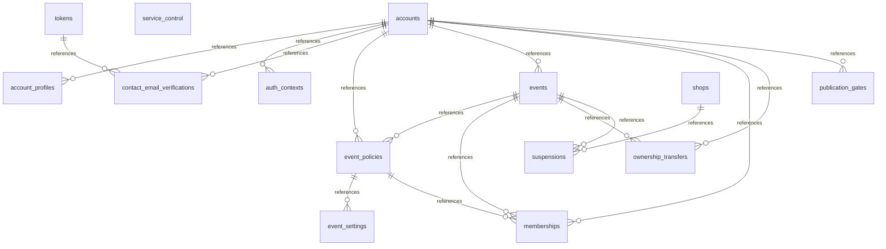
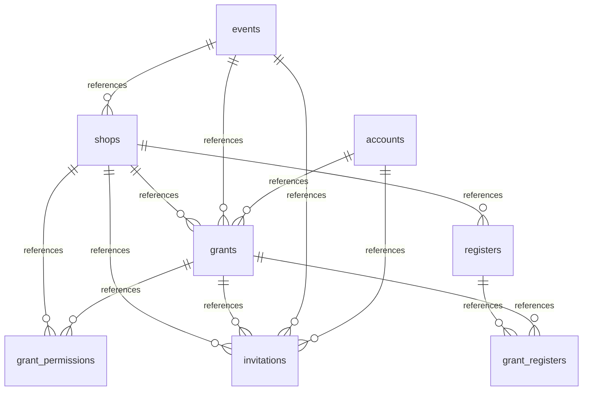
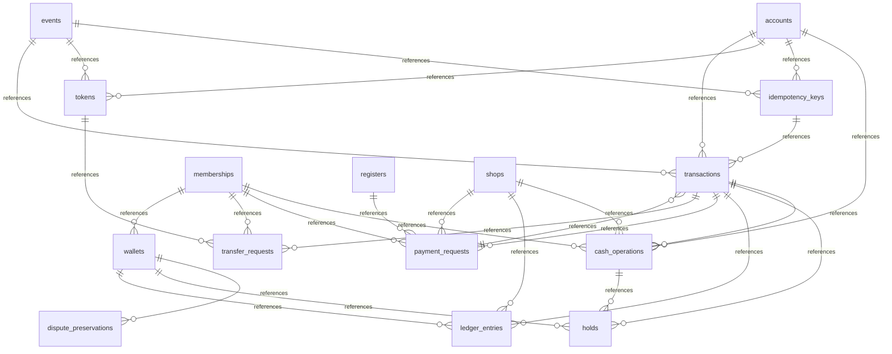
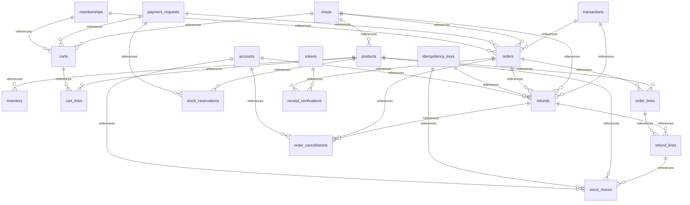
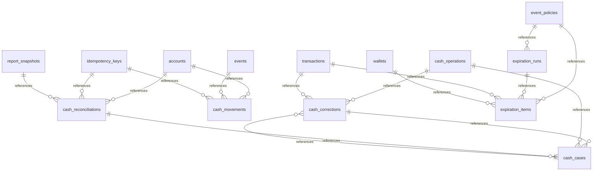
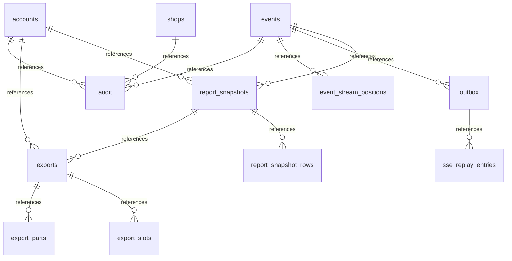

# DB物理モデルER図

状態：レビュー案。根拠は[設計方針](design.md)、全列/制約は[物理スキーマ](physical-schema.md)。領域ごとに55表を掲載し、SQLのFKから親子関係を抽出した。関連する領域外の親も図に表示する。線は親子参照を示し、必須/任意・1対1・同時件数は列のNULLと一意制約を参照する。

## 認証・イベント・管理

## 店舗・権限

## 金銭・台帳

## 商品・注文・返金

## 現金照合・失効

## 集計・出力・配信

認証基盤のidentity/session/因子/OAuth表は外部所有境界で、この図に複製しない。accounts.auth_user_refで業務IDへ対応付ける。SSEの公開Outbox UUIDを配信順にせず、sse_replay_entries.positionを使う。
