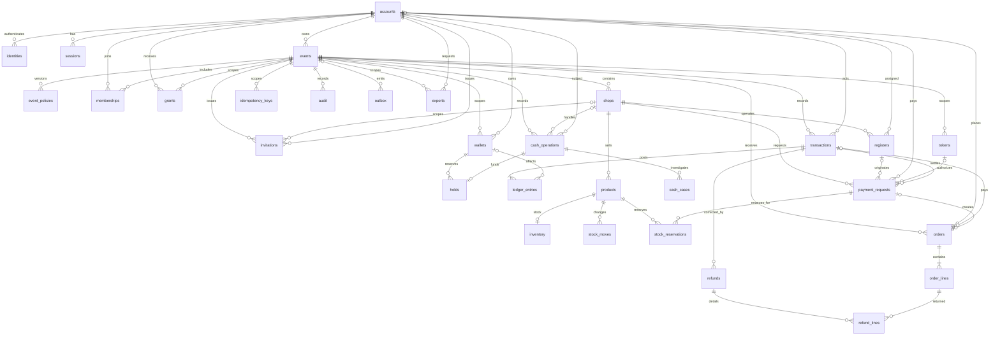

# FesPay ER図（レビュー案）

根拠は `detailed-design.md` 7.2–7.3。30表を網羅する。カラムと制約の詳細は[テーブル定義書](db-table-definitions.md)。関連線は詳細設計に明示された関係を中心に描き、残りは列上のFK案を反映する。図は物理DDLレビュー前の提案。

## 全体図

## 領域別図

全体図を領域で読むための区分（各表は全体図に一度ずつ含む）。

1. **アカウント・認証・イベント・参加・権限**: accounts, identities, sessions, events, event_policies, memberships, grants, invitations。
2. **店舗・レジ・残高・決済・台帳・現金**: shops, registers, wallets, holds, transactions, ledger_entries, idempotency_keys, payment_requests, tokens, cash_operations, cash_cases。
3. **商品・在庫・注文・返金**: products, inventory, stock_moves, stock_reservations, orders, order_lines, refunds, refund_lines。
4. **運用**: audit, outbox, exports。

## 関係上の注意

- Membershipは `(event_id, account_id)` 一意で、参加と権限付与は別関係。Walletもevent/accountで一意。
- Shopはeventの子。register/product/order等のevent_idとshop_idを複合FKに含め、イベント越境を拒否する案。
- ProductとInventoryは商品ごとの現在庫、StockMoveは追記専用の変動履歴。StockReservationはpayment request/productごとに一意。
- TransactionとLedger Entryは同一eventで結び、transactionごとに2件以上の均衡仕訳を遅延検査する提案。
- `o|` は任意参照を表す。削除は原則RESTRICT。多対多はmembershipsやgrants等の関係表で表現。
- 詳細設計7.2にFKの列定義が不足する箇所は要確認で、線は案を示す。
