# FesPay 詳細設計書

## 1. 文書概要

| 項目 | 内容 |
|---|---|
| 文書ID | EPP-DES-002 |
| 文書名 | FesPay 詳細設計書 |
| 対象システム | FesPay |
| 対象基本設計書 | [EPP-DES-001](basic-design.md)（設計v0.2、レビュー案） |
| 対象要件書 | [EPP-REQ-001](../requirements/event_payment_requirements.md)（現行v0.2、CR-0001承認済み） |
| 版 | 0.2 |
| 作成日 | 2026-10-01 |
| ステータス | レビュー指摘修正案・再レビュー待ち |
| 担当 | 未割当 |
| レビュー者 | 未割当 |
| 更新日 | 2026-10-07 |
| 目的 | 確定仕様と明示した詳細設計上の補完を分け、実装の境界・永続化・処理規約を定める |

対象は基本設計の初期対象に限る。初期対象外機能は実装しない。実金銭運用可能、法令適合、性能達成、セキュリティ監査済みを示す文書ではない。基本設計がレビュー案であり、本書もその承認状態を引き継ぐ。

## 2. 設計方針

### 2.1 根拠・区分

基本設計記載の確定事項を **基本設計確定**、実装に必要な追加判断を **詳細設計上の補完**、決定権者・外部確認・実測が必要なものを **未決** と表記する。補完は基本設計を変更せず、要件変更が必要な業務ルールは追加しない。[CR-0001](../requirements/changes.md)は2026-09-30承認済みであり、[PR #5](https://github.com/fespay-team/fespay/pull/5)でmainに反映された現行要件v0.2を根拠に、QR表示・関連付け後承認・見積・在庫予約の期限と安全な再試行条件を確定仕様として扱う。

### 2.2 実装規約

| 項目 | 規約 |
|---|---|
| 技術 | React + Vite、Hono + Node.js、Better Auth、PostgreSQL、SSE + Outbox、オブジェクトストレージ（基本設計確定） |
| ID | 内部主キーはUUID。外部公開識別子・短い表示番号・認証秘密を分離（UUID方式自体は補完、形式は未決） |
| 名前 | DBはsnake_case、TypeScriptはcamelCase、型・コンポーネントはPascalCase。要件IDは変更しない（補完） |
| 時刻 | DB timestamptz UTC、API UTC ISO 8601、UI Asia/Tokyo。受付期間は開始含み終了含まず |
| 金額 | APIは10進数字文字列、DB NUMERIC(30,0)、演算は任意精度整数。1～30桁の正数入力、途中オーバーフローは全体拒否 |
| API | HTTPS JSON `/v1`、セッションCookie、更新時CSRF、許可Originのみ。成功応答はCOMMIT後 |
| エラー | `{code,message,request_id,retryable,current_state_or_query?}`。金銭の応答不明は未成立と判定せず同じキーで照会 |
| Tx | 金銭・関連注文/在庫/台帳・残高射影・監査・Outboxを単一PostgreSQLトランザクションに含める |
| ログ | 構造化、request_id/correlation_id、秘密・認証情報・QR生値を記録しない |

DBの各テーブル名・型・索引など本書で具体化したDDL詳細は、確定DDLと同等の変更管理対象とする。DDLレビュー前に本書の補完を既成の基本設計仕様として扱わない。

## 3. システム構成詳細

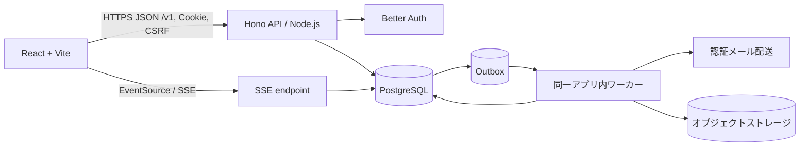

| 境界/コンポーネント | 責務と通信 | 依存規則 |
|---|---|---|
| Web UI | 画面状態、入力補助、確認表示、API呼出し。権限の最終判断をしない | API契約のみ参照。DB/秘密鍵へ接続しない |
| Hono route/controller | HTTP解析、認証主体・CSRF・共通エラー、DTO変換 | applicationへ依存。直接SQL/金銭計算を置かない |
| application/use case | ユースケース、認可、Tx境界、結果照会 | domainとportへ依存 |
| domain | 金額、状態遷移、仕訳規則、業務不変条件 | DB/HTTP/外部SDKへ依存しない |
| infrastructure | PostgreSQL repository、Better Auth、メール、ストレージ、clock/logger | domain/application portを実装 |
| Outbox worker | 行ロック取得、配送、再試行、結果記録 | 配送成功を業務Txの成功条件にしない |
| PostgreSQL | 業務正本、台帳、残高射影、監査、Outbox | アプリ以外から更新不可 |
| SSE | 認証・所属を確認し、許可された更新通知のみ送信 | 通知本文を正本にせず、クライアントはAPI再取得 |

**詳細設計上の補完:** デプロイは単一の論理アプリケーションとワーカー役割を同一コードベースで提供する。別サービス化はしない。構成製品、リージョン、スケール方式は未決。ブラウザからDB/ストレージ秘密へ直接アクセスしない。

## 4. ディレクトリ・モジュール構成

```text
apps/web/src/{app,features,shared}
apps/api/src/{http,middleware,modules,workers,bootstrap}
packages/{contracts,domain,application,infrastructure}
packages/domain/src/{money,ledger,identity,event,shop,order}
packages/application/src/{auth,events,roles,payments,cash,transfers,refunds,inventory,orders,reports}
packages/infrastructure/src/{postgres,storage,mail,auth,observability}
database/{migrations,seeds}
```

すべて**詳細設計上の補完**。FEはcontracts以外のserver内部モジュールに依存しない。domainはapplication/infrastructure/httpに依存しない。applicationはdomainとportに依存し、infrastructureがportを実装する。モジュラーモノリスを維持し、モジュール間の書込みはapplication use case経由とする。DB migrationはレビュー済みの順方向変更を基本とし、成立取引の削除・書換えをするrollbackを作らない。実際のworkspace/パッケージ管理ツールと配置は未決事項 U-06。

## 5. 認証詳細設計

Better Authのsession/accountを認証の基盤にする。アプリ側は内部`account_id`を主体として用い、外部provider subjectを業務データに使わない。

| 処理 | 入力・処理/DB | 成功・失敗 | エラー/安全策 |
|---|---|---|---|
| メール登録・確認 | メール、15～128文字PW。正規化メール一意確認、Better Authでハッシュ保存、確認tokenはハッシュ保存 | 未確認状態のアカウントとメールOutbox。確認tokenは24h | `AUTH_INVALID`/`AUTH_RATE_LIMITED`; 生PW/tokenをログに出さない |
| メールログイン | 資格情報をBetter Authで検証しsession発行 | Cookieを返す | 不一致は同一応答、レート制限、資格情報列挙を防止 |
| Googleログイン | ID tokenをサーバー検証（署名、iss、aud、exp、nonce）。`provider+subject`一意 | 既存identityへ接続、なければ新規認証主体 | メール一致だけで自動統合しない。無効tokenは拒否 |
| identity連携/解除 | 既存主体再認証＋追加provider認証、最終認証手段は解除不可 | identity変更をAudit記録 | `AUTH_REAUTH_REQUIRED`、`AUTH_LAST_METHOD` |
| session/logout | HttpOnly/Secure/SameSite cookie、無操作7日・絶対30日。logoutで現session、全端末logoutで全session失効 | session状態を失効 | 失効主体は次のAPI要求から401 |
| PW再設定 | 30分token、単回消費、成功時既存session失効 | 通知はOutbox | token生値を保存・記録しない |
| 認証主体取得 | cookie→Better Auth→account有効性・メール確認・event停止を読み取る | `Principal{accountId,sessionId,authenticatedAt,mfaAt}` | 未認証401、停止主体403 |

TOTPは30秒周期、±1周期、再利用不可、5回/5分失敗後15分停止。回復コードは一回限りのハッシュ。業務追加認証の最大8h/無操作30分、特権操作5分以内要件はAPIごとに再検証する。メール配送事業者やcookie具体属性は未決。

## 6. 認可詳細設計

認証済みhandlerは`authorize(principal, event_id?, shop_id?, operation, resource?)`を呼ぶ。サーバーは操作に応じてアカウント状態、本人確認、membership、grant、event/shop/register停止、機能設定、受付期間、必要MFA、対象行の所属を検証する。画面表示状態を信用しない。ID指定リソースはevent/shop/account複合関係を照合し、秘匿対象は404を返す。API IDだけで一括許可せず、HTTPメソッド・用途・本人操作/業務操作を別のoperationにする。E03参加、S02招待受諾は所属を作る入口であり、既存membership/grantを前提にしない。公開一覧E01と認証入口A01/A02は各入口の検証規約を適用する。

| 主体 | API操作範囲（基本設計API ID、メソッド・用途別） | 強制確認 |
|---|---|---|
| アカウント本人・参加前 | A01～A04の本人認証管理、E02 POST作成/GET案内、E03 POST参加、S02 POST受諾、S04指名された新所有者の受諾 | E02作成は確認済み有効アカウント。参加は条件版・同意・必要時PW、招待受諾は宛先本人・期限・発行者の現役権限。S04は旧所有者の再認証・指名と新所有者本人の受諾を別操作で検証。E02 PATCHは主催者のみ |
| 来場者 | E04 GET本人用ホーム、Q02承認/Q03本人用途/Q04照会、T01～T04本人分、C02本人照会、F01～F03、H01本人申出、P01 GET/P03/P05、O01/O02/O04本人申出/O05、W01/W02、N01 | event membership、wallet/request/cart/orderの本人所有、対象店舗の販売・機能・期限、明示承認。E04は本人情報とイベント案内だけで業務集計を返さない。P01 POST・P02/P04や他人の承認は不可 |
| 主催者 | E02 PATCH/E04～E09、S01/S03/S04、Q01/Q03業務用途/Q04、T02店舗操作/T03/T04業務照会/T05、C01～C05、H01受付/H02～H04、P01 GET・POST/P02/P04、O02～O04、R01～R05 | owner一致、自eventの操作・必要MFA/理由。Q02の本人承認を代行せず、任意残高編集不可 |
| 運営担当 | C01～C05、H01受付/H02～H04、Q01/Q03業務用途/Q04、T02～T05業務用途、P01 GET・POST/P02/P04、O02～O04、R01～R05のうち個別許可された操作 | active grantのevent・必要時shop・operation、停止状態、操作別追加認証。H04は払戻し管理、C03/T05は訂正、R05は監査の専用権限。イベント設定・運営任命・招待は不可 |
| 店舗管理者 | E08 PATCH自店舗、S01/S03自店舗レジ担当、Q01/Q03業務用途/Q04、T02店舗操作/T03/T04自店舗照会、P01 GET・POST/P02/P04、O02～O04、R01/R03/R04 | event＋shop所属、主催者許可範囲。E08 POST店舗作成・S04所有者交代は不可。返金は下記の個別権限が必要 |
| レジ担当 | Q01/Q03業務用途/Q04、T02店舗操作/T03/T04自店舗照会、P01 GET会計用、O02/O03 | register割当、shop・event一致、最新会計/受渡し権限。商品変更・返金・集計・CSVは下記の個別権限がある場合だけ許可、招待不可 |
| 商品・在庫の個別権限者 | P01 POST/P02/P04 | 対象店舗の商品/在庫管理grant。P01 GETの閲覧権限とは分離 |
| 返金権限者 | R02、O04の返金を伴う店舗取消 | 元取引event/shop一致、返金grant、MFA、累計・数量上限。返金grantだけでC03/T05の訂正は許可しない |
| 集計・CSVの個別権限者 | R01/R03/R04 | 現在のevent/shop集計・CSV grant。R04は生成者一致と取得時の現在権限を確認 |
| プラットフォーム管理者 | A05/E10/R05 | 特権grant・MFA・理由。業務権限自己付与不可 |

兼務者の本人操作には来場者の条件を適用し、業務ロールを本人承認の代用にしない。Q03はさらに次の用途で分ける。受取用情報をO05/F03で発行する場合も同じ用途検証を適用する。

| Q03の用途 | 発行/表示 | resolve/関連付けの主体・条件 |
|---|---|---|
| 受付用QR | 参加済み本人 | 対象イベントの該当現金処理権限者。本人特定に限り、チャージ/払戻し確定の権限・承認を与えない |
| B方式支払QR | 参加済み本人 | 対象店舗会計権限者。最初の有効な要求への一回関連付け |
| A方式会計QR | 対象店舗会計権限者 | 参加済み支払者本人。最初に関連付いた本人のみQ02承認可 |
| 譲渡受取QR | 参加済み受取人本人 | 同イベントの送信者本人。譲渡ON・相手照合・送信者承認を別途検証 |
| 注文受取情報 | 注文所有者本人 | 自店舗の受渡し権限者。受取照合と消費を同一Txで検証 |

権限と資源状態の読取り・業務更新を同一Tx内で行う。grant変更との競合はgrant行をFOR UPDATEでロックし、金銭確定と解除の順序を直列化する。結果照会と冪等再送の保存結果返却にも現在の本人所有/業務照会権限を検証する。解除済み担当者には業務結果を返さない。照会には新規処理の受付期間・機能OFF・販売終了の条件を流用せず、履歴と既存手続の安全な完了・取消・調査は操作別条件で許可する（ROL-06、CSH-04、TX-03～05）。

## 7. データモデル物理設計

### 7.1 共通規約

以下の物理表は**詳細設計上の補完案**である。全表に`created_at timestamptz NOT NULL DEFAULT now()`、更新される表に`updated_at timestamptz NOT NULL DEFAULT now()`、必要な行に`version integer NOT NULL DEFAULT 1 CHECK(version>0)`を持たせる。金銭・監査履歴は論理削除しない。FKは原則`ON DELETE RESTRICT ON UPDATE RESTRICT`。参照不能な一時秘密は期限後削除。すべてのevent子表にevent_idを持たせ、複合FKでevent越境を防ぐ。IDの生成・UUID方式は未決。

### 7.2 テーブル定義

省略なしの列一覧を示す。`NN`=NOT NULL、`?`=NULL可。UNIQUE/INDEX/CHECKも各行に記載する。単一列PKは`id UUID NN PK`で表す。

| テーブル（論理名） | 列定義: `物理名 型 NULL DEFAULT 制約 —意味/値域` | 一意・検索・ライフサイクル |
|---|---|---|
| accounts（アカウント） | `id UUID NN`、`email CITEXT NN`、`email_verified_at timestamptz ?`、`status text NN 'ACTIVE'`、`display_name varchar(100) NN`、共通日時 | PK id、UNIQUE email、CHECK status ACTIVE/SUSPENDED/DELETION_PENDING。identity参照中削除不可。認証基盤との分離方法は未決 |
| identities（外部認証） | `id UUID NN`、`account_id UUID NN`、`provider text NN`、`provider_subject text NN`、`created_at` | PK、FK accounts、UNIQUE(provider,provider_subject)、INDEX(account_id)。provider値メール/Google（Better Auth内部形式に合わせる） |
| sessions（セッション） | `id UUID NN`、`account_id UUID NN`、`token_hash bytea NN`、`expires_at timestamptz NN`、`revoked_at timestamptz ?`、日時 | PK、FK accounts、UNIQUE token_hash、INDEX(account_id,expires_at)。期限後削除可能 |
| events（イベント） | `id UUID NN`、`owner_account_id UUID NN`、`name varchar(100) NN`、`status text NN`、`listing_status text NN`、`participation_mode text NN`、`starts_at/ends_at timestamptz NN`、`settings jsonb NN '{}'`、`version int NN 1`、日時 | PK、FK accounts、CHECK時刻順・状態列挙、INDEX(status,starts_at,id)。業務履歴参照中削除不可 |
| event_policies（条件版） | `id UUID NN`、`event_id UUID NN`、`version int NN`、`terms jsonb NN`、`effective_at timestamptz NN`、`created_by UUID NN`、`created_at` | PK、FK event/account、UNIQUE(event_id,version)、INDEX(event_id,effective_at)。append-only |
| memberships（参加） | `id UUID NN`、`event_id UUID NN`、`account_id UUID NN`、`status text NN 'ACTIVE'`、`accepted_policy_version int NN`、`joined_at timestamptz NN`、日時 | PK、複合一意(event_id,account_id)、FK event/account/policy。INDEX(account_id,status)。参加だけではgrantなし |
| grants（権限付与） | `id UUID NN`、`event_id UUID NN`、`account_id UUID NN`、`shop_id UUID ?`、`operation text NN`、`status text NN`、`granted_by UUID NN`、`version int NN 1`、日時 | PK、FK event/account/shop、7.4のshop NULL/非NULL別の部分一意索引、INDEX(event_id,shop_id,status)。同一scope/operationは状態にかかわらず1行、再付与はversion更新＋監査。親発行者削除に依存しない |
| invitations（招待） | `id UUID NN`、`event_id UUID NN`、`shop_id UUID ?`、`token_hash bytea NN`、`email CITEXT NN`、`grant_spec jsonb NN`、`status text NN`、`expires_at timestamptz NN`、`created_by UUID NN`、`accepted_by UUID ?`、日時 | PK、UNIQUE token_hash、INDEX(event_id,status,expires_at)。72h・一回限り、秘密ハッシュは失効30日後削除 |
| shops（店舗） | `id UUID NN`、`event_id UUID NN`、`name varchar(100) NN`、`description varchar(1000) NN ''`、`status text NN`、`suspension jsonb NN '{}'`、`version int NN 1`、日時 | PK、UNIQUE(event_id,id)、INDEX(event_id,status)。参照履歴があれば削除不可 |
| registers（レジ） | `id UUID NN`、`event_id UUID NN`、`shop_id UUID NN`、`register_code varchar(64) NN`、`status text NN`、`assigned_account_id UUID ?`、日時 | PK、複合FK(event_id,shop_id)、UNIQUE(shop_id,register_code)、INDEX(shop_id,status) |
| wallets（残高射影） | `id UUID NN`、`event_id UUID NN`、`account_id UUID NN`、`available_amount numeric(30,0) NN 0`、`held_amount numeric(30,0) NN 0`、`refund_only_amount numeric(30,0) NN 0`、`version bigint NN 1`、日時 | PK、UNIQUE(event_id,account_id)、UNIQUE(event_id,id)、複合FK membership、CHECK各額>=0、INDEX(event_id,account_id)。台帳から再構築可能な射影 |
| holds（払戻し拘束） | `id UUID NN`、`event_id UUID NN`、`wallet_id UUID NN`、`cash_operation_id UUID NN`、`source_bucket text NN`、`hold_transaction_id UUID NN`、`release_transaction_id UUID ?`、`amount numeric(30,0) NN`、`status text NN`、`expires_at timestamptz NN`、`version int NN 1`、日時 | PK、複合FK event/wallet/operation/transaction、CHECK amount>0、CHECK source_bucket IN('AVAILABLE','REFUND_ONLY')、UNIQUE(cash_operation_id)、INDEX(event_id,status,expires_at)。HELD時に作成、元区分を保持し取消は同区分へ戻す。自動解除禁止 |
| transactions（取引） | `id UUID NN`、`event_id UUID NN`、`type text NN`、`status text NN 'SUCCEEDED'`、`amount numeric(30,0) NN`、`actor_account_id UUID NN`、`source_ref UUID ?`、`occurred_at timestamptz NN`、`idempotency_id UUID NN`、`metadata jsonb NN '{}'`、`created_at` | PK、UNIQUE(event_id,id)、FK event/account/idempotency、CHECK amount>0、INDEX(event_id,occurred_at DESC,id)、INDEX(source_ref)。確定後更新/削除禁止 |
| ledger_entries（台帳明細） | `id UUID NN`、`event_id UUID NN`、`transaction_id UUID NN`、`account_code text NN`、`wallet_id UUID ?`、`amount numeric(31,0) NN`、`created_at` | PK、複合FK(event_id,transaction_id)、FK wallet、INDEX(event_id,transaction_id)、INDEX(wallet_id,created_at)。transaction内SUM(amount)=0は遅延制約triggerで検査。append-only |
| idempotency_keys（冪等結果） | `id UUID NN`、`event_id UUID NN`、`actor_account_id UUID NN`、`operation text NN`、`key varchar(128) NN`、`request_hash bytea NN`、`result_resource_id UUID ?`、`response_snapshot jsonb ?`、`status text NN`、`created_at` | PK、UNIQUE(actor_account_id,event_id,operation,key)、INDEX(status,created_at)。取引保存期間保持 |
| payment_requests（支払要求） | `id UUID NN`、`event_id UUID NN`、`shop_id UUID NN`、`register_id UUID ?`、`payer_account_id UUID ?`、`token_id UUID ?`、`type text NN`、`status text NN`、`amount numeric(30,0) NN`、`content_snapshot jsonb NN`、`content_hash bytea NN`、`expires_at timestamptz NN`、`version int NN 1`、`transaction_id UUID ?`、日時 | PK、複合FK shop/event、FK account/transaction、CHECK amount>0、CHECK type IN('A','B','C')、CHECK status<>'AWAITING_APPROVAL' OR payer_account_id IS NOT NULL、7.4のB承認待ち部分一意索引、INDEX(event_id,status,expires_at)。状態列挙は10章 |
| tokens（用途限定token） | `id UUID NN`、`event_id UUID NN`、`purpose text NN`、`token_hash bytea NN`、`subject_account_id UUID ?`、`resource_id UUID ?`、`expires_at timestamptz NN`、`consumed_at timestamptz ?`、`revoked_at timestamptz ?`、日時 | PK、UNIQUE token_hash、INDEX(event_id,purpose,expires_at)。一回消費は条件付きUPDATE |
| cash_operations（現金処理） | `id UUID NN`、`event_id UUID NN`、`shop_id UUID ?`、`account_id UUID NN`、`operator_account_id UUID NN`、`type text NN`、`balance_source text ?`、`status text NN`、`amount numeric(30,0) NN`、`transaction_id UUID ?`、`external_fact text ?`、`reason text ?`、`version int NN 1`、日時 | PK、UNIQUE(event_id,id)、複合FK event/shop/transaction、FK accounts、CHECK amount>0、CHECK type<>'CASH_REFUND' OR (balance_source IS NOT NULL AND balance_source IN('AVAILABLE','REFUND_ONLY'))、7.4の未完了払戻し部分一意索引、INDEX(event_id,type,status,created_at)。通常/返金専用交付は共通type CASH_REFUNDで元区分を区別 |
| cash_cases（現金調査案件） | `id UUID NN`、`event_id UUID NN`、`cash_operation_id UUID NN`、`status text NN`、`reason text NN`、`assigned_to UUID ?`、`resolved_at timestamptz ?`、`resolution jsonb ?`、日時 | PK、FK operation/account、INDEX(event_id,status,created_at)。解決履歴はAuditにも追記 |
| products（商品） | `id UUID NN`、`event_id UUID NN`、`shop_id UUID NN`、`name varchar(100) NN`、`description varchar(1000) NN ''`、`price numeric(30,0) NN`、`status text NN`、`image_key text ?`、`version int NN 1`、日時 | PK、UNIQUE(event_id,shop_id,id)、複合FK shop、CHECK price>0、INDEX(shop_id,status,name)。物理削除不可、停止状態で保管 |
| inventory（現在在庫） | `event_id UUID NN`、`shop_id UUID NN`、`product_id UUID NN`、`on_hand bigint NN 0`、`reserved bigint NN 0`、`version bigint NN 1`、日時 | PK(event_id,product_id)、複合FK product/shop、CHECK 0<=reserved<=on_hand AND on_hand<=2147483647、INDEX(shop_id,product_id)。保持型bigintでもINV-03の32-bit非負整数範囲を超える値は拒否 |
| stock_moves（在庫移動） | `id UUID NN`、`event_id UUID NN`、`shop_id UUID NN`、`product_id UUID NN`、`kind text NN`、`refund_line_id UUID ?`、`idempotency_id UUID NN`、`delta bigint NN`、`reason text NN`、`actor_account_id UUID NN`、`created_at` | PK、複合FK product/shop/refund_line、FK idempotency、CHECK delta<>0、CHECK (kind='RETURN_TO_STOCK' AND refund_line_id IS NOT NULL AND delta>0) OR (kind<>'RETURN_TO_STOCK' AND refund_line_id IS NULL)、UNIQUE(idempotency_id,refund_line_id)、INDEX(event_id,product_id,created_at)、INDEX(event_id,refund_line_id)。append-only、再販戻しは元返金明細必須 |
| stock_reservations（予約） | `id UUID NN`、`event_id UUID NN`、`shop_id UUID NN`、`product_id UUID NN`、`payment_request_id UUID NN`、`order_line_id UUID ?`、`quantity integer NN`、`status text NN`、`expires_at timestamptz NN`、`version int NN 1`、日時 | PK、FK product/request/order line、UNIQUE(payment_request_id,product_id)、CHECK quantity BETWEEN 1 AND 999、INDEX(event_id,status,expires_at) |
| orders（注文） | `id UUID NN`、`event_id UUID NN`、`shop_id UUID NN`、`account_id UUID NN`、`transaction_id UUID ?`、`payment_request_id UUID ?`、`display_number varchar(32) NN`、`channel text NN`、`status text NN`、`fulfillment_status text NN`、`total_amount numeric(30,0) NN`、`version int NN 1`、日時 | PK、UNIQUE(event_id,shop_id,id)、UNIQUE(event_id,shop_id,display_number)、FK membership/shop/transaction/request、CHECK total>=0、INDEX(shop_id,status,created_at)、INDEX(account_id,created_at) |
| order_lines（注文明細） | `id UUID NN`、`event_id UUID NN`、`order_id UUID NN`、`product_id UUID NN`、`product_name_snapshot varchar(100) NN`、`unit_price numeric(30,0) NN`、`quantity integer NN`、`line_total numeric(30,0) NN`、`product_version int NN`、`refunded_quantity integer NN 0`、日時 | PK、複合FK(order,event)、FK product RESTRICT、CHECK unit_price>0、quantity 1..999、line_total=unit_price*quantity、0<=refunded<=quantity、INDEX(order_id) |
| refunds（返金） | `id UUID NN`、`event_id UUID NN`、`original_transaction_id UUID NN`、`refund_transaction_id UUID ?`、`order_id UUID ?`、`actor_account_id UUID NN`、`destination_bucket text NN`、`amount numeric(30,0) NN`、`status text NN`、`reason text NN`、`idempotency_id UUID NN`、日時 | PK、FK event/transaction/order/key、CHECK amount>0、CHECK destination_bucket IN('AVAILABLE','REFUND_ONLY')、INDEX(event_id,original_transaction_id)、成立累計は元取引ロック下で検証。成立時の返金先分類を保持 |
| refund_lines（返金明細） | `id UUID NN`、`event_id UUID NN`、`refund_id UUID NN`、`order_line_id UUID NN`、`quantity integer NN`、`amount numeric(30,0) NN`、`restored_quantity integer NN 0`、日時 | PK、UNIQUE(event_id,id)、FK refund/line、CHECK quantity>0 AND amount>0、CHECK restored_quantity BETWEEN 0 AND quantity、INDEX(order_line_id)。返金数量・金額は成立後不変、復元済み数量だけ在庫戻しTxで更新する射影 |
| audit（監査） | `id UUID NN`、`event_id UUID ?`、`shop_id UUID ?`、`actor_account_id UUID ?`、`action text NN`、`target_type text NN`、`target_id UUID ?`、`reason text ?`、`before_data jsonb ?`、`after_data jsonb ?`、`request_id text ?`、`ip inet ?`、`created_at timestamptz NN` | PK、INDEX(event_id,created_at)、INDEX(actor_account_id,created_at)、追記のみ。credential/token/不要個人情報禁止 |
| outbox（後続配信） | `id UUID NN`、`event_id UUID ?`、`aggregate_type text NN`、`aggregate_id UUID NN`、`event_type text NN`、`payload jsonb NN`、`status text NN 'PENDING'`、`retry_count int NN 0`、`next_retry_at timestamptz NN now()`、`locked_at timestamptz ?`、`processed_at timestamptz ?`、`last_error_code text ?`、`created_at` | PK、UNIQUE(id)、CHECK retry_count>=0、INDEX(status,next_retry_at,created_at)。payloadに秘密を含めない |
| exports（CSV成果物） | `id UUID NN`、`event_id UUID NN`、`requested_by UUID NN`、`snapshot_id UUID NN`、`filters jsonb NN`、`status text NN`、`object_key text ?`、`row_count bigint ?`、`expires_at timestamptz NN`、`error_code text ?`、日時 | PK、FK event/account、INDEX(requested_by,status)、24時間後削除 |

`amount`のledgerは符号付きなので`numeric(31,0)`で差分を表し、各取引の絶対値は30桁以内。台帳合計ゼロ制約は複数行制約のため**詳細設計上の補完**として遅延constraint triggerでCOMMIT時に検証する。勘定科目コード一覧、残高射影と台帳の勘定マッピングはDDL確定時に固定する。

### 7.3 関係・削除更新

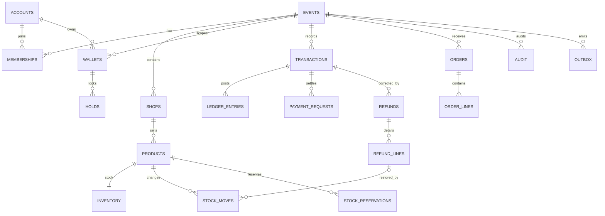

Membership (account,event)は一意、Walletも同一組で一意。ShopはEventの子、Register/Product/Orderはshop/event複合FKを持つ。Transactionは台帳明細を2件以上持ち、削除連鎖なし。Orderは複数line、Refundは複数refund_line。Reservationはrequest/product単位で一意、成立・期限切れ・取消の各処理で同じ行をロックする。履歴・金銭根拠がある行は物理削除しない。アカウント個人情報の分離はPRV-03～05と保存基準に従う。

### 7.4 同時件数・scopeの一意制約

次のSQLは7.2を具体化する**詳細設計上の補完案**。DDL/migration確定時に制約名・最終enumと一致させる。B方式は1利用者・1イベントの承認待ちを1件、現金払戻しは通常額/返金専用額を合わせて同時1件に制限する（PAY-B04、CSH-01）。

```sql
CREATE UNIQUE INDEX payment_requests_one_pending_b
  ON payment_requests (event_id, payer_account_id)
  WHERE type = 'B' AND status = 'AWAITING_APPROVAL';

CREATE UNIQUE INDEX cash_operations_one_open_refund
  ON cash_operations (event_id, account_id)
  WHERE type = 'CASH_REFUND'
    AND status IN ('PREPARED', 'HELD', 'CASH_HANDING', 'INVESTIGATING');

CREATE UNIQUE INDEX grants_event_scope
  ON grants (event_id, account_id, operation)
  WHERE shop_id IS NULL;

CREATE UNIQUE INDEX grants_shop_scope
  ON grants (event_id, account_id, shop_id, operation)
  WHERE shop_id IS NOT NULL;
```

B要求の関連付け時はwallet行、現金払戻し開始時もwallet行をロックして既存処理を再確認し、別キー・別端末・別担当の要求でも部分一意索引を最終防壁にする。競合は409 `INVALID_STATE`と認可済みの既存要求照会先を返す。同じ冪等キーの再送は9.3に従う。期限切れのB要求は要求・予約/在庫を共通順でロックし、実時刻で期限を確認してEXPIRED/予約解放を同一Txで確定してから新要求を作る。払戻しは警告期限を過ぎても拘束を自動解除せず、PAIDまたは未交付確認済みCANCELLEDまで新規開始を拒否する。PREPARED取消は未交付確認を記録し、拘束作成前なら残高移動は行わない。

PostgreSQLの通常UNIQUEはNULLを同値にしないため、shop_idがNULLのイベント全体grantと非NULLの店舗grantを別々の部分一意索引で保証する。通常UNIQUE(event,account,shop,operation)だけには依存しない。再付与時は同じgrant行を更新してversion・監査を残し、重複行を増やさない（[公式の一意制約仕様](https://www.postgresql.org/docs/current/ddl-constraints.html#DDL-CONSTRAINTS-UNIQUE-CONSTRAINTS)）。

## 8. 金銭・台帳詳細設計

`Transaction → Ledger Entry → Wallet/Account`を正本関係とする。Walletは読取性能用射影で、台帳なし更新は禁止。`available_amount`, `held_amount`, `refund_only_amount`は別区分であり、held/refund-onlyは支払可能額に含めない。

| 業務 | 台帳・業務データ | Wallet/在庫効果 |
|---|---|---|
| 現金チャージ | cash受領事実確認後、取引+利用者借方相当/現金受領勘定貸方の均衡仕訳 | available加算。現金事実とDB Txは非原子的、照合案件で扱う |
| 決済 | 利用者利用可能勘定から店舗売上勘定へ振替 | available減、注文なら売上/注文/在庫も同一Tx |
| 譲渡 | 送信者から受取人へイベント内振替 | 送信者減・受取人増、イベント総額不変 |
| 通常払戻し申出 | 本人承認でavailableからheldへ内部振替Transaction・仕訳・Holdを作成 | available減、held増。現金交付は未成立、受付ON・通常期間を検証 |
| 返金専用額の交付申出 | 本人承認でrefund_onlyからheldへ内部振替Transaction・仕訳・Holdを作成 | refund_only減、held増。主催者の精算用受付を検証し、通常払戻しOFF・通常受付終了だけでは拒否しない |
| 払戻しPAID | heldから払戻し済勘定へ別取引 | held減、現金交付記録。既交付現金を取消さない |
| 未交付取消 | heldからHold.source_bucketへ解放Transaction | held減、元区分を同額増。現金未交付確認必須、返金専用額をavailableへ変換しない |
| 購入返金 | 元取引を変更せず、新TransactionとRefundを追加 | 通常支払期間内かつ残高有効ならavailableへ、販売終了/失効後はrefund_onlyへ。返金専用額は支払・譲渡・自動失効不可 |
| 失効/訂正 | 理由・対象を参照する別Transaction | 既存仕訳を更新/削除しない |

各Transactionは正数amount、type、actor、event、idempotency参照を持つ。仕訳金額の絶対値は30桁以下、符号合計0、最低2行。`NUMERIC(30,0)`範囲を越える計算は全体ROLLBACK。丸めなし。数量は整数、金額からの換算なし。チャージ・譲渡・保有残高に業務上限を設けない。

### 8.1 返金専用額の精算用現金交付

返金専用額の現金交付はREF-03の確定仕様であり、新規の通常払戻し受付条件とは分ける。H01～H04の共通処理を用い、cash_operation.balance_sourceとHold.source_bucketを`REFUND_ONLY`として固定する。主催者が設定する精算用受付の場所・時間・連絡先はイベント条件版に保持する。本人確認・本人承認・対象残高・担当者の払戻し権限/業務追加認証は省略しない。通常額との混合申出は行わず、元区分を明示して1件ずつ処理する。

PREPAREDでは現金を渡さず、HELD遷移時にwalletをロックし、元区分減算・held加算・内部振替Transaction/台帳・Hold・監査・Outboxを同一Txで確定する。Hold.source_bucketはcash_operation.balance_sourceと一致させ、以後変更しない。Hold.hold_transaction_idで内部振替を参照する。現金交付TransactionはPAID時に別途成立し、cash_operation.transaction_idとHold.release_transaction_idで参照する。未交付取消は元区分への解放Transactionを追加し、Hold.release_transaction_idに保持する。これにより拘束中も台帳から3区分を再構築できる（LED-01/03）。

5分警告・30分調査一覧、CASH_HANDING以降の即時調査対象表示、自動解除禁止、結果不明時の再交付禁止、担当者引継ぎの監査は通常額と共通。受付終了後も開始済み手続の安全な完了・取消・調査を許可する。返金作成から30日は案内期間であり、未交付を理由に返金専用額/拘束を消去せず、未解決のままイベント完了・データ削除を許可しない（REF-03、CSH-02～06、EVT-06）。

## 9. トランザクション・排他・冪等性

### 9.1 共通Tx順序

1. `BEGIN`。冪等キー行を作成、競合時既存行を取得。
2. アカウント/セッション・event所属・grant・対象scopeを同一Txで再検証する。Event制御・認可行を共通順でロックまたは条件付き再読込する。既存キーは現在の結果照会権限、新規キーは操作権限・必要MFA・停止・機能・期間で認可し、拒否時は保存結果や内容相違を返さない。
3. 認可後に内容hashを照合する。異なれば409。同hashかつ完了済みなら現在の照会範囲に限定した保存結果を返し、業務更新を再実行しない。処理中なら202/409で同一キー照会へ案内する。受付終了・機能OFFだけを理由に既成立結果を未成立にしない。読み取りTxも終了してから応答する。
4. 新規処理の対象行を固定順で`SELECT ... FOR UPDATE`: walletsをaccount_id昇順、products/inventoryをproduct_id昇順、payment_requests/元transactions、orders/refundsとその明細、stock_reservations、cash_operations/holds、用途token。同種行はID昇順。不要な対象群は飛ばしてよいが、9.2の各業務・expiry worker・在庫戻しでも相対順を逆転させない。
5. 必要なロック取得後の実時刻で期限と業務条件・値域を検証し、業務データ・Transaction・Ledger Entry・wallet射影を更新。期限判定の時計は13章に従う。
6. AuditとOutboxを同じTxにINSERT。
7. 遅延仕訳制約とCHECKを検証してCOMMIT。応答はcommit後のみ。

**詳細設計上の補完:** IsolationはREAD COMMITTED + 明示行ロック・一意制約・条件付きUPDATEを標準とする。`40001`/`40P01`は内部で同一キー最大3回再試行（指数遅延なしの短いjitter、Tx全体を再実行）。超過は503 retryable、クライアントは同一冪等キーを維持する。分離レベルは実装・負荷試験で再確認する未決。

### 9.2 個別排他

| 競合 | ロック/制約・競合時 |
|---|---|
| wallet同時更新 | wallet行をevent/account順でFOR UPDATE。残高不足なら409、部分確定しない |
| 二重決済/Payment Request承認 | request行FOR UPDATE、`status=AWAITING_APPROVAL`条件付きUPDATE、transactionの要求参照一意、冪等キーUNIQUE |
| B承認待ちの同時作成 | wallet行と既存request/関連在庫を9.1の順でロック、7.4の部分一意索引。別キーの別会計は409、期限切れ旧要求は解放してから新規作成 |
| 二重返金 | 元transactionと対象order_lineをFOR UPDATE。確定refund累計・返金数量を再計算して上限超過409 |
| 二重払戻し | walletとcash_operation/hold行をFOR UPDATE、7.4の未完了払戻し部分一意索引、冪等キーUNIQUE。通常額/返金専用額を合わせて1件。CASH_HANDING後は自動解放禁止 |
| 返金商品の二重在庫復元 | inventory、元transaction、order/refundと明細を9.1の順でFOR UPDATE。成立返金数量－restored_quantity以内を条件付き更新、StockMoveと在庫を同一Txで追加 |
| 在庫競合 | inventory行product_id順FOR UPDATE。`on_hand-reserved >= qty`条件付き更新。全明細一括、不可なら全体拒否 |
| reservation expiry vs pay | reservation行FOR UPDATE、期限と状態をDB時刻で判定。成立か解放の一方だけが状態更新 |
| 注文同時更新 | order行FOR UPDATEとversion条件。古いversionは409＋最新状態 |
| 権限解除 vs commit | grant行を金銭業務行より先にFOR UPDATE。解除が先なら拒否、確定が先なら解除後は新規操作不可 |

### 9.3 冪等性

金銭/在庫確定APIは`Idempotency-Key`必須（1～128 ASCII可視文字、**補完**）。DB一意キー `(actor_account_id,event_id,operation,key)`、canonical JSON SHA-256を保存する。同じ内容は同じresource/結果を返す。同キー異内容は409 `IDEMPOTENCY_CONFLICT`。応答喪失時は同キー再送またはresource照会。すべての結果返却・内容衝突・処理中応答の前に、現在の本人所有/業務照会権限を9.1のTx内で再検証する。過去の実行権限や冪等キーを照会権限の代用にしない。処理中行は短時間待機後202/409 `REQUEST_IN_PROGRESS`を返し、二重処理しない。永続保持は台帳と同期間。Outboxは`outbox.id`を配信側dedupe keyにする。配信はat-least-once、受信側重複排除を必須とする。

## 10. 状態遷移詳細

基本設計で定義された状態名を維持する。下表にない任意遷移、終端状態からの復帰を禁止する。DB状態CHECKは列挙、遷移許可はapplicationと条件付きUPDATEで検証。

| 対象 | 許可遷移 | 禁止/例外 |
|---|---|---|
| Event | 下書き→公開・準備中→開催中→販売終了→精算中→完了 | 完了後訂正は理由付き再開。未解決残高/現金/注文/返金があれば完了不可 |
| Payment Request | CREATED→AWAITING_APPROVAL→SUCCEEDED/DECLINED/CANCELLED/EXPIRED。CREATED→CANCELLED | SUCCEEDEDから逆遷移なし。内容変更は旧取消+新規 |
| Transaction | 作成→SUCCEEDEDの一方向。現金結果不明等の業務状態はcash_operation/caseに保持 | 成立Transactionの取消/UPDATE/DELETE禁止。訂正は別取引 |
| 払戻しcash_operation/Hold | cash_operationはPREPARED→HELD→CASH_HANDING→PAID。HELD時にHold作成、未交付確認後CANCELLED、結果不明→INVESTIGATING | 通常額/返金専用額で共通。5分警告、30分調査一覧、自動解除なし。CASH_HANDING以降調査必須、取消解放は元区分へ |
| Refund | 要求→成立、または未完了調査 | 元Transaction変更なし。30日経過で消去しない |
| Order | 支払待ち→受付済み→調理・準備中→受取待ち→受取完了 | 支払済取消は返金と対応。提供/返金状態は独立 |
| Stock Reservation | RESERVED→CONSUMED / RELEASED / EXPIRED | 終端から遷移なし。部分予約なし |
| Membership | ACTIVE→SUSPENDED/LEFT（基本設計上の主体状態に従う） | wallet残高処理前の削除不可。正確な状態名・退会手順はOpenAPI/DDL確定事項 |
| Shop/Register | ACTIVE↔SUSPENDED、registerの割当/解除 | 停止で履歴削除しない。店舗/レジ全状態語彙は要件から不足、要確認 |
| Invitation | ISSUED→ACCEPTED/DECLINED/EXPIRED/REVOKED | 72h、一回限り。受諾時権限再計算 |

membership/shop/registerの状態語彙など基本設計が一意に定めない箇所は補完候補として本節に記載したが、最終enumは未決 U-18。

## 11. API詳細設計

APIパスは基本設計14章の論理案を引き継ぎ、パスを確定仕様とはしない。実装時の契約はOpenAPIが正本。共通ルール: JSON body、UUID path、UTF-8、金額文字列、UTC日時、カーソル不透明文字列。POST成功は201、非同期CSV受付202、GET 200、削除/失効204。認証不要は公開イベント一覧と認証入口のみ。更新系はCSRF。全pathで親子所属を検証。

| API群/ID | Request要点→Response要点 | 認証・Tx・代表競合 |
|---|---|---|
| A01–A04 | 認証入力→主体/session状態 | Better Auth処理。資格情報は応答・監査へ含めない |
| E01–E10 | 検索/イベント設定/参加/停止/完了→event、version、状態 | E03 membership一意。設定更新はIf-Match/version。完了判定Tx |
| S01–S04 | 招待先/権限/受諾→invitation/grant状態 | tokenハッシュ一回消費、受諾とgrant作成同一Tx |
| Q01–Q04 | 店舗/方式/金額/明細/承認内容版→request状態/transaction ID | request承認はwallet・requestロック、内容hash一致。GETは結果照会 |
| T01–T05/W01–W02 | wallet summary、履歴、取引、訂正理由→残高/取引結果 | T02/T05は冪等必須。成功応答はcommit後 |
| C01–C05/H01–H04 | QR/額/現金事実/担当/調査理由、H01 balance_source→cash_operation/hold/case | H01の元区分AVAILABLE/REFUND_ONLYをサーバー検証し、後者は精算用受付を適用。内部振替と現金交付の台帳Txを区別。結果不明を照会し、勝手に再現金交付しない |
| F01–F03 | 受取token/金額/承認→譲渡結果/受取QR | 送受walletをID順ロック、event同一・譲渡ON |
| P01–P05 | 商品/在庫移動/カート/checkout→商品版/予約期限/request | P01 GETは商品閲覧、POSTは商品管理。P02再販戻しはkind/refund_line_id/数量/再販売可能確認/理由/キー必須、累計数量を再検証。画像5MB制限。checkout全明細予約を単一Tx |
| O01–O05 | 支払request/注文状態/受取確認→order・line snapshot | 決済・注文・在庫・台帳同一Tx。状態更新はversion必須 |
| R01–R05 | 集計条件/CSV条件→report/export/snapshot | 範囲認可、snapshot固定、download時再認可 |
| N01 | Last-Event-ID→SSE stream | 有効認証+event membership、送信対象再認可 |

### 11.1 金銭APIの代表JSON型

```ts
type Money = string; // /^(0|[1-9][0-9]{0,29})$/。業務入力では1以上
type ErrorBody = { code: string; message: string; request_id: string;
  retryable: boolean; current_state_or_query?: { resource_id: string; status?: string } };
type CreatePaymentRequest = {
  shop_id: string; register_id?: string; method: "A" | "B" | "C";
  amount: Money; currency: "JPY"; lines?: Array<{product_id:string; quantity:number; product_version:number}>;
  content_version: number;
};
type TransactionResult = { transaction_id:string; status:"SUCCEEDED";
  event_id:string; amount:Money; currency:"JPY"; occurred_at:string; request_id:string };
```

**詳細設計上の補完:** currency固定値JPY、数量1..999、version一致を契約候補とする。支払応答に不要な個人情報を返さない。具体path/schema/error HTTP最終対応はU-03/U-15。

### 11.2 API validation

Bodyはstrict schema（未知フィールド拒否）、UUID形式、文字列長・列挙値・範囲・親子関係をサーバー検証。金額は指数・符号・小数・空白・先頭ゼロ（`0`以外）を拒否。時刻はoffset付きRFC3339。ページ上限は基本設計値を維持（イベント20、履歴50、各最大100等）。エラーは14章。

## 12. エラー設計

| code | HTTP | 表示/ログ/再試行 | クライアント動作 |
|---|---:|---|---|
| AUTH_REQUIRED / AUTH_INVALID | 401 | 再ログイン案内、INFO、不可 | 認証画面へ |
| FORBIDDEN / RESOURCE_NOT_FOUND | 403/404 | 範囲外を露出しない、WARN、不可 | 権限/対象確認 |
| VALIDATION_ERROR | 422 | 項目修正、INFO、不可 | 入力修正 |
| INVALID_STATE / VERSION_CONFLICT | 409 | 最新状態案内、INFO、不可 | 再取得し再確認 |
| INSUFFICIENT_BALANCE / INSUFFICIENT_STOCK | 409 | 部分確定なし、INFO、不可 | 金額/数量再確認 |
| IDEMPOTENCY_CONFLICT | 409 | 同じキーで照会、WARN、不可 | 元要求を照会、キー再利用禁止 |
| REQUEST_IN_PROGRESS / RESULT_UNKNOWN | 202/409 | status照会、INFO、可（同キーのみ） | resource照会。新キーを生成しない |
| TOKEN_EXPIRED / TOKEN_CONSUMED | 409 | 新規発行案内、INFO、不可 | 用途に従い再取得 |
| RATE_LIMITED | 429 | retry-after、WARN、待機後可 | 指示時間待つ |
| DEPENDENCY_UNAVAILABLE / DB_UNAVAILABLE | 503 | request_id付き、ERROR、条件付き可 | 同一キー照会/再送 |
| INTERNAL_ERROR | 500 | 一般文言、ERROR、原則不可 | request_idで問い合わせ |

例外handlerはSQL詳細・stack・秘密をresponseへ返さない。DB connection消失時はcommit結果不明として冪等レコード/取引照会を優先する。

## 13. QR・トークン詳細

承認済みCR-0001に従い、受付QR60秒、B表示QR60秒、A表示QR300秒、譲渡受取QR300秒、関連付け後承認・見積・在庫予約180秒を確定仕様とする。固定Cは公開識別URLで金額・残高・承認を含めず、停止/再発行可能。

受付/B表示QRは前面表示中・有効セッションで操作中の場合だけ自動更新する。旧tokenは自身の期限までで、更新によって延長しない。A方式は未関連付けのまま期限切れになり、会計の金額・商品版・販売可否が不変かつ店舗画面が前面で有効業務セッションにある場合だけ新QRを生成する。画面終了・バックグラウンド化・ログアウト・会計変更・販売停止で自動生成を停止する。

A/Bの本人関連付け時に要求・見積・全明細予約の180秒期限を同じ実時刻から設定し、QR表示期限と独立させる。未関連付けA表示だけでは予約しない。表示更新で関連付け済み要求を失効させない。関連付け後の拒否・期限切れは旧要求/予約を解放し、価格・在庫・権限・停止状態を再検証した新要求を作る。旧要求・見積・予約の期限を延長しない。譲渡受取QRは1譲渡で消費し、次回は受取人が新規発行する。UIは各期限の残り時間・期限前警告と安全な再試行導線を表示する。

QR本体は自サービスのHTTPS URLと不透明tokenのみ。金額・残高・氏名・メール・恒久権限を含めない。tokenはCSPRNG生成、生値を発行応答だけで返しDBにはSHA-256以上の検証用hash保存。**bit長は基本設計未決のため固定しない**。用途ごとのpurpose/event/subject/resource/expiry/消費・失効状態を照合する。QR読取成功は決済成功でなく、Payment Requestの確定結果を照会する。

### 13.1 ロック取得後の期限判定

PostgreSQLの`now()`/`CURRENT_TIMESTAMP`はTx開始時刻で固定されるため、期限判定に使わない。9.1の必要な行ロックをすべて取得した後、`clock_timestamp()`を一度取得して判定時刻とする。たとえばtoken消費は次の順に行い、lock待ち中に期限を越えた要求を受理しない（[公式の日時関数仕様](https://www.postgresql.org/docs/current/functions-datetime.html#FUNCTIONS-DATETIME-CURRENT)）。

```sql
-- BEGINと現在の認可、関連業務行のロック取得後に実行する。
SELECT id FROM tokens WHERE id = :token_id FOR UPDATE;
SELECT clock_timestamp() AS checked_at;
-- checked_atは直前に取得したサーバー値。クライアント値は使わない。
UPDATE tokens
   SET consumed_at = :checked_at
 WHERE id = :token_id
   AND consumed_at IS NULL
   AND revoked_at IS NULL
   AND expires_at > :checked_at
RETURNING id;
```

更新0件なら期限切れ/消費済み/失効として拒否する。用途・event・subject・resource一致もロック下で検証し、関連付け/金銭更新と同一Txで消費する。Payment Request承認、見積、在庫予約、招待受諾も必要ロック後の実時刻で判定し、境界は`checked_at < expires_at`、期限と等しい時刻は拒否する。途中で追加のロック待ちが生じた場合は全必要ロック取得後に実時刻を取り直して再検証する。監査・作成日時のDEFAULT now()は記録用途なので維持する。

## 14. 商品・在庫・注文

商品更新はversion付き。価格・商品名・商品version・単価・数量・合計をcheckout時にrequest/order lineへsnapshot保存し、商品master更新で過去注文を変更しない。数量は整数、販売可能数=`on_hand-reserved`。在庫移動は理由付きStockMove追記とinventory残高更新を同一Tx。負数・予約数未満・INV-03の32-bit非負整数範囲を超える調整は拒否。

Checkoutはカートversion、商品status/価格version、店舗受付、在庫を再検証し、全明細予約180秒と支払要求を一括作成。予約中の価格固定はsnapshotに保持。決済成功でinventory.on_handとreservedを予約数量分減算、reservationをCONSUMED、注文/line/ledgerを作成。取消・期限切れはreservedのみ解放しRELEASED/EXPIREDにする。expiry workerと決済は予約行ロックで競合解決。

OrderLineは商品名、単価、商品版、数量、line_totalを保存。部分返金はrefund_lineの数量・金額を追記し、提供状態を書き換えない。再販可能在庫への戻しは自動で行わず、P02の`RETURN_TO_STOCK`として対象返金明細・数量・再販売可能確認・理由・冪等キーを指定する。対象商品/注文/返金明細が同じevent/shopに属し、返金が成立済みであることを検証する。金額入力会計など商品返金明細がない返金ではこの在庫戻しを行わない。

在庫戻しは9.1の共通順でinventory、元transaction、order/refundと対象明細をロックし、`復元可能数 = refund_line.quantity - restored_quantity`を計算する。指定数量が復元可能数を超えたら409、負数・0・在庫値域超過も全体拒否する。`restored_quantity + qty <= quantity`条件付き更新、正数StockMove追加、inventory.on_hand加算、監査・Outbox・冪等結果を同一Txで確定する。StockMoveはrefund_line_idを保持し、射影restored_quantityはその明細へのRETURN_TO_STOCKのdelta合計から再計算できる。成立後の返金数量・金額は書き換えない。同じキーは既存結果、別キーでも残り数量を超えられず、並行実行による二重復元を拒否する（REF-04、AT-046）。

受取照合は8桁コード、注文/10分5失敗で保留、公開呼出画面に氏名・メール・残高を出さない。

## 15. Outbox・SSE

### 15.1 Outbox

イベント形式: `{id,event_id,aggregate_type,aggregate_id,event_type,occurred_at,schema_version,payload}`。payloadは通知に必要な最小情報とresource IDのみ。金銭詳細・秘密tokenを含めない。Workerは`SELECT ... FOR UPDATE SKIP LOCKED`でPENDINGかつnext_retry_at到来行を取得し、短時間ロック後に配送。成功はPROCESSED/processed_at、失敗はretry_count+1、指数バックオフ（1s,2s,4s...最大15m、**補完**）、last_error_code更新。最大試行後も削除せずDEAD状態/運用アラートにし、手動再実行は同event IDを保つ。外部配送はat-least-once。

### 15.2 SSE

`GET /v1/events/{event_id}/stream`。session cookieで認証しCSRFはGETのため不要、Originを検査、event membership/許可範囲を確認。heartbeat 20秒（補完）、`id:`はoutbox UUID、`event:`は許可型、`data:`は最小JSON `{resource_type,resource_id,version}`。Last-Event-IDから再開できない/保持範囲外の場合`resync`を送信し、正本API再取得を促す。接続中も停止・membership失効を再確認し、権限外・他eventのeventを配信しない。SSEは成功証明でない。

## 16. 監査・ログ

Auditは金銭、権限、招待、返金、払戻し、現金、停止/再開、所有者交代、失効、CSV生成/取得、特権調査を記録。actor/event/shop/action/target/time/reason/request_idと必要な差分を記録する。IPは不正調査目的に限定しPRV保存期限を適用。before/afterからemail、PW、token、TOTP、回復コード、session cookie、全文リクエストを除去。監査行は追記のみで通常アプリから更新削除不可。

アプリログはJSONで`timestamp,level,service,request_id,correlation_id,account_id?,event_id?,operation,code,duration_ms`。errorはstackをアクセス制限ログへ分離。ログレベルDEBUG開発、INFO通常、WARN拒否/競合、ERROR障害。アクセス/認証ログ30/180日、台帳・重要監査は基本設計の7年等の保持基準に従う。DBログ・保存先・鍵は環境台帳で確定。

## 17. CSV・レポート・ストレージ

集計はイベント/店舗/期間を認可scopeで絞り、決済成立時刻、返金成立時刻を別々に集計。売上=成立商品決済、純売上=決済-返金。チャージ・譲渡・未使用払戻しは店舗売上に含めない。CSVはUTF-8 BOM、CRLF、RFC4180 quoting、式注入対策（先頭`=+-@`等は文字列化）、金額は整数数字列、認証秘密/メール除外。10万行/ファイル、超過連番分割、同時生成2件、24h期限、権限範囲ごとsnapshot固定。出力は正本ではない。

| 成果物 | object key案（補完） | 制御 |
|---|---|---|
| 商品画像 | `events/{event}/shops/{shop}/products/{product}/{random}.{ext}` | JPEG/PNG/WebPのみ、5MB、実体・寸法検査、2048px長辺、EXIF除去・再encode。公開可否/URL設計は未決 |
| CSV | `exports/{event}/{exportId}/{part}.csv` | private bucket、生成者/現在権限を毎回確認、短時間署名URL、24h削除 |

ストレージにユーザー指定URLをfetchしない。拡張子だけでなくContent-Type/マジックbyteを検証。object keyに生メール・氏名・秘密を含めない。具体容量/署名URL TTL/暗号化製品は未決。

## 18. セキュリティ・バリデーション

| 対象 | 制御 |
|---|---|
| 認証/権限 | Better Auth、CSRF、MFA、全handlerでaccount+event+shop+operation検証。IDだけを根拠にしない |
| SQLi | parameterized query、動的order/filter allowlist |
| XSS | React escaping、HTML挿入禁止、CSP。CSV式注入対策 |
| CSRF/CORS | cookie更新系はCSRF token + Origin、許可Origin allowlist |
| SSRF | 外部URL取得機能なし、画像をサーバーfetchしない |
| Rate limit | login/参加PW/受取コード/token/API単位。共用会場IPだけで一括banしない |
| Security headers | HTTPS/HSTS、CSP、frame-ancestors、nosniff、Referrer-Policy（具体値は環境確定） |
| 機密情報 | secrets manager/env注入、ログ・URL・analyticsへtoken/credentialを出さない |
| 金銭保護 | MFA、確認画面、冪等、wallet/元取引/在庫ロック、台帳原子性 |

全検証はサーバー側必須。API共通: bodyサイズ上限、strict schema、許容文字長、enum、UUID、cursor/page上限、数値domain、イベント・店舗・アカウント関係を検査する。画面検証はUX補助に限る。API固有の確定値はOpenAPIで定義し、未決値を暗黙決定しない。

## 19. データ整合性ルール

| 不変条件 | DB制約 | アプリ | Tx/排他 |
|---|---|---|---|
| 金額範囲/正数 | NUMERIC、CHECK >0 | 文字列・桁検証、BigInt | 超過時全ROLLBACK |
| 仕訳合計0/event一致 | FK、遅延trigger | 勘定科目・2行以上生成 | Transaction+entries原子 |
| 利用可能残高非負 | wallet CHECK | 残高不足判定 | wallet FOR UPDATE |
| event/shop所属一致 | 複合FK | scope認可 | 同一Txで最新権限検査 |
| 二重確定なし | UNIQUE冪等/参照 | 状態遷移 | 対象行FOR UPDATE |
| B承認待ち/未完了払戻しは各1件 | 7.4の部分一意索引、B承認待ちpayer NN | 既存要求確認、通常額/返金専用額の共通枠 | wallet/要求ロック、競合409 |
| grant scope一意 | shop NULL/非NULL別の部分一意索引 | 再付与は同じ行の版更新 | grant行ロック、変更監査 |
| 返金累計以下 | 索引/FK | 元額・数量累計検証 | 元transaction/order_lineロック |
| 再販戻し累計は成立返金数量以内 | StockMoveのrefund_line FK、restored_quantity CHECK | 成立・再販売可能確認・残り数量/所属照合 | inventory/元取引/明細ロック、在庫/StockMove/射影同一Tx |
| 返金専用額の交付/取消 | source_bucket列挙、Hold/Transaction FK | 精算用受付、取消は元区分、通常OFFと分離 | wallet/現金処理/holdロック、台帳同一Tx |
| 再送結果も現在の照会権限内 | 冪等キー主体/event FK | 現在の本人所有/業務照会権限 | 保存結果返却前にTx内再認可 |
| 期限境界を越えて消費/承認しない | 期限列、消費/状態条件付きUPDATE | 全必要ロック後のclock_timestampで検証 | ロック待ち後再判定、expires_atと同時は拒否 |
| 在庫予約以内 | CHECK reserved<=on_hand | 可用数/全明細検証 | inventory/reservationロック |
| 注文snapshot不変 | FK、列制約 | masterからsnapshot作成 | 成立後変更なし |
| 監査/台帳append-only | 権限、trigger | 訂正は別行 | 同一Txで関連付け |

## 20. テスト設計

試験を実施したという意味ではない。受入ID AT-001～070は既存管理表を正本とする。

| レイヤ | 観点 |
|---|---|
| Unit | 金額30桁/31桁、拒否形式、仕訳均衡、状態遷移、返金累計、権限policy |
| DB統合 | FK/UNIQUE/CHECK、複合event FK、遅延仕訳制約、append-only、migration |
| API | request/response schema、全認証・認可境界、IDOR、error mapping、rate limit |
| Tx/冪等 | 同一キー再送、異内容衝突、commit前障害、commit後応答喪失、DB rollback、結果照会 |
| 排他 | 同一wallet決済、B承認待ち同時作成、二重承認、二重返金、通常/返金専用払戻し同時開始、再販戻し累計、予約expiryと決済、注文同時遷移 |
| Outbox/SSE | worker二重起動、配送失敗/backoff/dead、SSE切断・再接続・Last-Event-ID・範囲越境 |
| 商品/在庫 | 価格変更後snapshot、部分予約を起こさない競合、全量rollback、在庫戻しの元返金明細・累計・監査 |
| Security | CSRF/XSS/SQLi/SSRF、token再利用、権限解除race/保存結果再送、商品GETと管理POSTの分離、QR用途別主体、招待受諾、secret log、画像偽装、CSV式注入 |
| 境界/運用 | 0/負/30桁/桁超過、受付境界、現金DB非原子・結果不明、Outbox遅延、復旧/照合 |

特に通信timeoutは「未成立」と断定しない。実金銭試験、負荷試験、法務/セキュリティ評価の実施前に合格と記録しない。

### 20.1 レビュー指摘の検証計画

以下は既存受入IDの合格条件を具体化する実装後の試験計画で、全件未実施。新しい受入IDや試験合格を追加したものではない。

| 関連受入ID | 条件/操作 | 期待結果 |
|---|---|---|
| AT-010、AT-025、AT-029、AT-033 | 来場者がP01 GET・本人受付/B QR発行・A/C読取を行い、同じ主体でP01 POSTや別人/別用途のQRも操作 | 正当な閲覧/本人用途だけ許可、商品変更・他人/用途違い操作は拒否、残高/在庫に副作用なし |
| AT-013～014 | 所属がない招待先本人がS02受諾、別人・期限切れ・発行者解除後・並行受諾も送信 | 有効な本人招待だけ1回所属/権限を作成、既存membershipを前提にしない。不正条件は拒否 |
| AT-015、AT-038 | 成立した業務操作の同じキーを権限解除後に再送。権限を維持した主体でも受付終了後に同キーを再送 | 解除済み担当へ業務結果を返さず、現在の照会権限者だけ元結果へ復帰。再更新・受付終了による元成立の取消なし |
| AT-042～044、AT-047～048 | 通常払戻しOFF/受付終了/失効後の返金専用額を精算用受付で交付。未交付取消・交付不明・再送・30日経過も確認 | refund_only→held→交付を台帳と一致させ、取消はrefund_onlyへ戻す。交付不明は拘束/調査維持、二重交付・支払可能額化・自動消去なし |
| AT-046 | 1個返金に対し1個再販戻し後、同キー・別キーで再送。2端末の同時戻しや別店舗明細も指定 | 同キーは元結果、別キー/並行でも返金数量以内。StockMove合計＝restored_quantity、越境拒否、在庫/監査/射影の部分成立なし |
| AT-030、AT-042～043 | 別キーのB要求を2店舗から同時作成。通常額/返金専用額の払戻しを別担当・別キーで同時開始 | B承認待ちと未完了現金払戻しは各1件。敗者409、拘束・在庫・台帳に部分更新なし。INVESTIGATING中も新規払戻し不可 |
| AT-012、AT-014～016 | shop_id=NULLの同一grantを並行付与し、店舗scopeの重複・別店舗・解除後再付与も確認 | 同じscope/operationは1行、別店舗scopeは独立。再付与は同じ行の版更新＋監査、重複grantによる解除回避なし |
| AT-013、AT-025、AT-031～032、AT-039、AT-050 | 期限直前にTxを開始し、対象行のロック待ちで期限を越える。QR/承認/見積/予約/招待の直前・同時・直後も比較 | ロック取得後のサーバー実時刻で境界拒否。QR更新と関連付け後180秒は独立、旧要求/予約延長なし、決済と解放は片方だけ成立 |

## 21. シーケンス図

以下は主要フローの処理境界を表す。承認済みCR-0001を適用し、金銭更新・照会認可・行ロック順・期限判定は6～9章と13章を共通規約とする。

### 21.1 ログイン
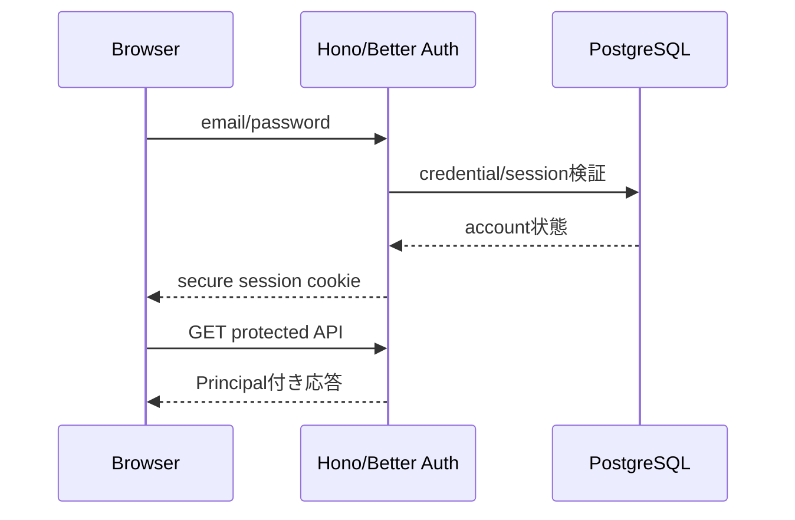

### 21.2 イベント参加
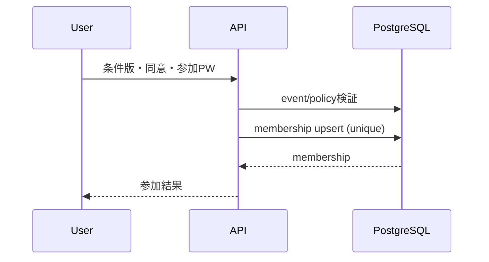

### 21.3 現金チャージ
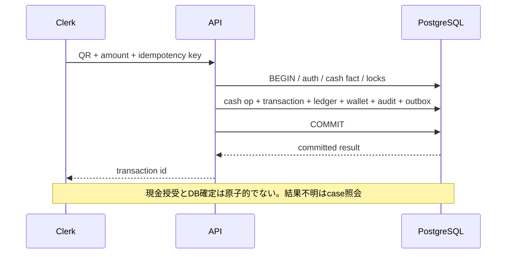

### 21.4 QR決済
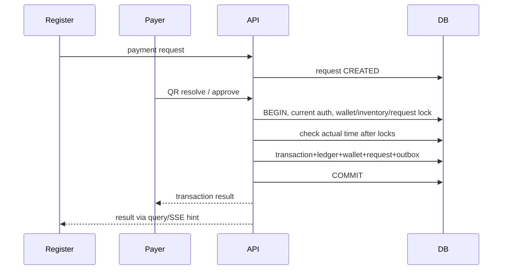

### 21.5 譲渡
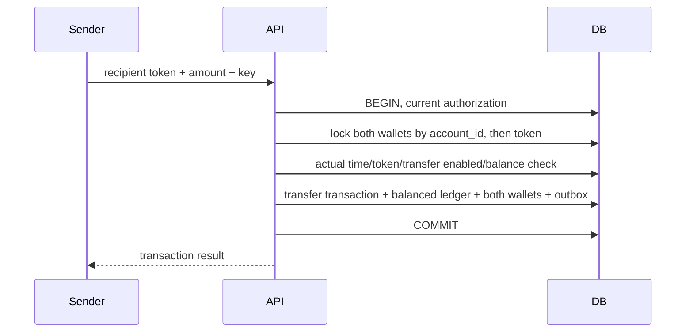

### 21.6 払戻し申請・確定
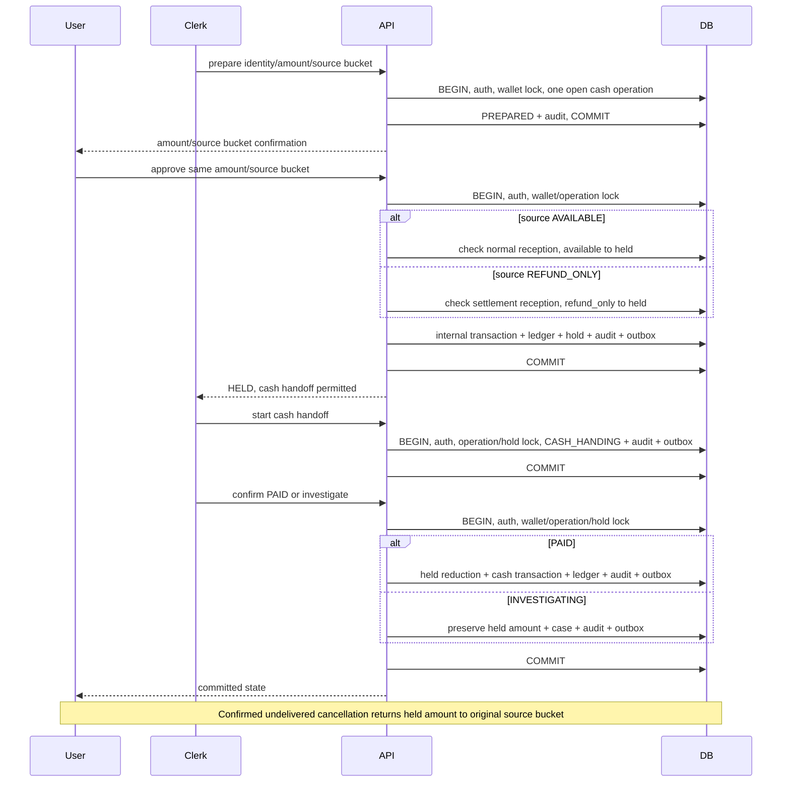

### 21.7 購入・取消・部分返金
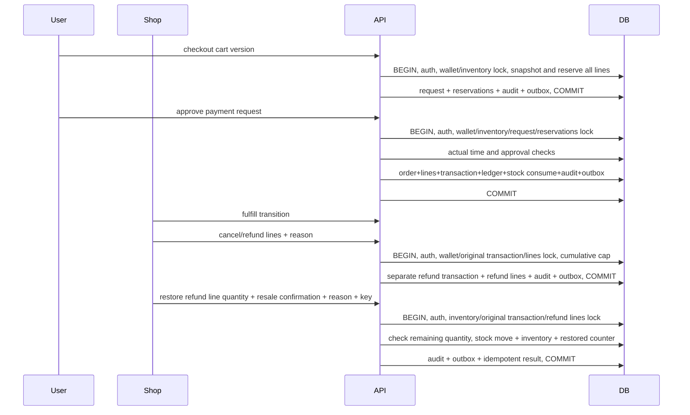

### 21.8 在庫予約
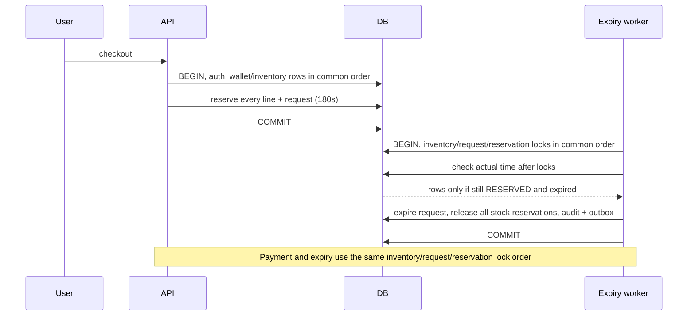

### 21.9 Outbox・SSE
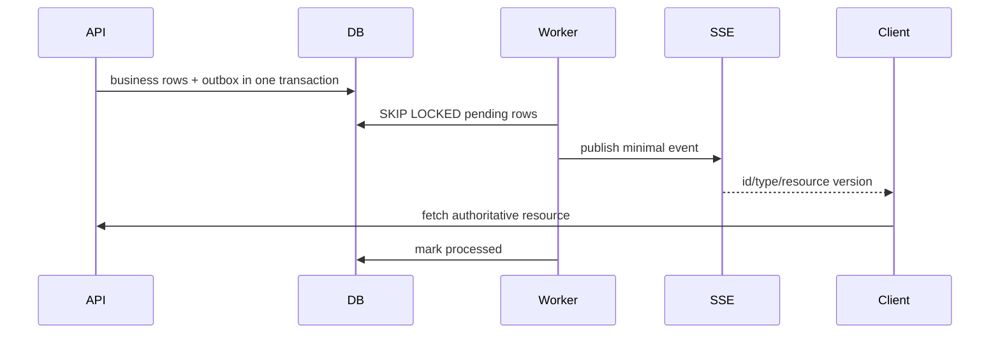

## 22. トレーサビリティ

要件IDの完全索引は基本設計36.3を正本として維持する。本表は主要機能単位の実装追跡表であり、既存要件IDを改名しない。

| 要件ID | 基本設計章 | 詳細設計章 | 実装対象 | テスト観点 |
|---|---|---|---|---|
| ACC-01～06, SEC-01～06 | 15,29 | 5,6,18 | auth/session/mfa | login、token、失効、権限 |
| EVT-01～06, JOIN-01～03 | 8,10 | 6,7,10,11 | event/membership/policy | 期間境界、参加一意、完了条件 |
| ROL-01～06, STF-01～05 | 6,15 | 6,7,9 | grants/invitations/audit | 越権、解除race、受諾期限 |
| MNY-01/02, WAL-01～04, LED-01～06 | 17,24 | 7～9,19 | wallet/transaction/ledger | 桁境界、均衡、rollback、競合 |
| TX-01～06, PAY-A/B/C, QR-01～03 | 14,16～18 | 9,11～13 | payment request/token | 二重承認、timeout、token再利用 |
| CHG-01～06, CSH-01～07 | 10,19,25 | 8,9,11,12,21 | cash operation/hold/case | 現金不明、二重交付、拘束 |
| TRF-01～06 | 20 | 8,9,13 | wallet transfer | 二口座競合、イベント境界 |
| REF-01～04, EXP-01～03 | 19,24 | 7～9,14 | refund/refund_line | cumulative cap、返金専用額 |
| PRD-01/02, INV-01～05, ORD-01～06 | 21,22 | 7,9,14,21 | product/inventory/order | 予約競合、snapshot、受取 |
| API-01～05, DAT-01～03 | 14,24 | 2,7,11,18,19 | contracts/DB | schema/FK/IDOR |
| RPT-01～06, PRV-01～05 | 25,26,29 | 7,16,17 | reports/export/audit | 範囲、CSV注入、保持期限 |
| NET-01～04, PWA-01/02 | 5,13,28 | 3,15,21 | SSE/client cache | 再接続、権限外配信 |
| SEC-07～11, PERF-01～13, OPS-01～06 | 29～32 | 3,16～20 | API/infra/observability | セキュリティ、性能、復旧 |
| GOV/LEG/REL/DEV/CHGLOG | 1～3,30～36 | 1,20,23 | gate/運営/変更記録 | gate未完了公開防止 |

## 23. 未決事項

本表は基本設計35章U-01～U-17を引き継ぎ、本詳細設計で露呈した不足を追加する。推奨は案であり、決定扱いではない。

| ID/項目 | 根拠・現状/決める理由 | 候補・推奨 | 影響・変更時注意 |
|---|---|---|---|
| U-01 法的発行主体/法令該当性 | 基本設計未決。資金流れ・上限なし・譲渡・現金払戻しの評価必要 | 法務/関係機関確認を推奨 | 実金銭公開gate、wallet/transfer/cash |
| U-02 運営責任者/終了後窓口 | 未割当 | 主催者・プラットフォーム責任境界を公開前に決定 | 問合せ/保存・公開gate |
| U-03 OpenAPI、Cookie、OAuth callback | APIは論理案 | OpenAPI YAMLを正本化し本文重複を避ける（推奨） | UI/API契約 |
| U-04 物理ER、UUID、分離レベル、勘定科目 | 本書は補完案 | PostgreSQL実機でDDL/競合試験し決定 | 全DB、金銭移行に注意 |
| U-05 クラウド/リージョン/鍵/監視 | 未選定 | 要件RPO/RTOと契約を満たす構成を評価 | ARC/OPS |
| U-06 package/runtime/lockfile | 実版未確定 | 対応期限までにADRとlockfile固定 | build・脆弱性更新 |
| U-07 Google/メール配送 | 未契約 | 開発/本番分離し実機確認 | auth/通知 |
| U-08 QR端末/カメラ/公開cache | 実機未評価 | 複数端末・共用回線で評価 | QR/公開導線 |
| U-09 WCAG/320px評価 | 未実施 | 実機・支援技術評価 | UI |
| U-10 負荷環境・実測 | 未測定 | PERF条件で測定し結果報告 | DB/index/scale |
| U-11 RPO/RTO実装証明 | 未実証 | WAL/PITRと復元・障害試験 | 復旧 |
| U-12 保存期間の法務確認 | 基準は基本設計採用済み | 現基準を維持し、変更は要件変更で扱う | PRV/削除 |
| U-13 招待/全認証喪失窓口 | 未決 | 本人確認窓口・手順を運営決定 | account recovery |
| U-14 object storage/暗号化/期限削除 | 未選定 | private bucket・削除検証を推奨 | 画像/CSV |
| U-15 最終HTTP error mapping/UI文言 | 未確定 | OpenAPIと文言表で固定 | clients |
| U-16 現金実査/差異解消手順 | 運用責任未決 | 模擬運営後に手順確定 | 現金照合 |
| U-17 表示注文番号/照合番号 | 詳細未決 | 推測困難性と現場読み上げ性を評価 | 受取・問い合わせ |
| U-18 Membership/Shop/Register列挙、状態履歴 | 基本設計で全列挙なし | 有効/停止等の状態機械を要件照合後にDDL化 | 6,7,10章。勝手なenum確定不可 |
| U-19 token長/正確な乱数仕様、CSV signed URL TTL | QR強度・TTL未決 | 脅威評価と事業者仕様確認で決める | QR/ストレージ。URL公開漏えいを防ぐ |
| U-20 PostgreSQL trigger実装/台帳勘定体系 | 本書の遅延triggerは補完 | migration・復元・並行Txで実証 | 台帳正本、後方互換注意 |

## 24. 詳細設計で補完した事項

| 項目 | 根拠 | 判断 | 理由・影響 | 将来変更時の注意 |
|---|---|---|---|---|
| 物理テーブル群/共通日時 | 論理データモデル | 7章のUUID/FK/日時/CHECK案 | 実装可能なDDL案を示す | DDL化前にER/移行レビュー |
| Isolation/lock順 | TX-03/04/06、LED-03/04 | READ COMMITTED+行lock+一意制約 | 明示した行単位競合制御 | 性能測定後変更、台帳原子性維持 |
| Idempotency-Key長/hash | 冪等必須 | 1..128文字、canonical hash | 同一キー異内容拒否 | key scope変更は再送互換を壊す |
| 結果再送の認可順序 | ROL-06、TX-03～05 | 保存結果返却前に現在の照会権限をTx内で確認 | 解除後の業務結果取得を防ぐ | 新規処理の期間条件を照会へ流用しない |
| 同時件数・grant scope制約 | PAY-B04、CSH-01、ROL-03 | 7.4の状態別/NULL別部分一意索引 | 別キー・並行実行でも一意性を維持 | 最終enum・索引predicateを合わせる |
| 返金専用交付の元区分保持 | REF-03、LED-01/03 | cash_operation/Holdに元区分、拘束・交付・解放は別台帳取引 | 精算用受付と正しい取消戻し先を実装 | 通常OFF/受付終了と精算受付を分離 |
| 再販戻し数量の射影 | REF-04 | StockMoveの元返金明細、restored_quantityを同一Txで更新 | 別キーでも累計超過を防止 | 元金額・返金数量は不変、射影はStockMoveから再計算 |
| 期限判定の時計 | QR/INV/TX/STFの期限 | 必要ロック後のclock_timestamp | ロック待ち中の期限超過を拒否 | 作成日時DEFAULT now()と判定時刻を区別 |
| Outbox retry | DB+後続通知整合 | SKIP LOCKED/at-least-once/backoff | worker多重実行耐性 | consumer側重複排除を保持 |
| SSE payload/heartbeat | SSE通知方針 | resource ID/versionのみ、20s heartbeat | 個人/金銭情報露出抑制 | Last-Event-ID保持期間を合わせる |
| API TS型/JPY | 金額・API方針 | 代表型を提示、JPY固定 | 型検証の実装開始支援 | OpenAPIを正本化 |
| CSV object key/画像制御 | 保存/画像要件 | private key命名案、5MB/形式制限再掲 | 混在・実行ファイル防止 | 実サービス制約確認 |
| エラーコード群 | 基本設計共通error | 章12の候補コード | UI/再試行を統一 | HTTP最終mappingはOpenAPIで確定 |
| directory分割 | モジュラーモノリス | 4章案 | 依存方向と実装所有境界 | repo ADR/実装開始時調整 |

## 25. 自己レビュー・今後の成果物

| 観点 | 確認結果 |
|---|---|
| 基本設計整合 | 現行要件v0.2・承認済みCR-0001の期限/自動更新/再試行を反映。OpenAPI/DDL等の実装方式は補完案・未決として区別 |
| 用語/ID | 要件ID・主要用語を維持。要件ID完全索引は基本設計36.3を参照 |
| 金銭 | 台帳を正本、walletは射影、返金別取引、通常/返金専用額の拘束・交付・取消を区別。同一Tx/冪等/結果不明を記述 |
| DB/API | 物理表・型・制約案と代表JSONを提示。最終DDL/OpenAPI一致は未検証・未作成 |
| 状態/権限 | 商品GET/管理POST・QR用途・参加/招待入口・再送照会の認可を分離。同時件数制約と再販戻し累計を明示。membership等一部enumは未決として残す |
| セキュリティ/運用 | IDOR、CSRF、XSS、SQLi、SSRF、秘密ログ、CSV/画像制御、試験観点を記載。監査未実施 |

次工程では、(1) U-01～U-20の担当と決定日を記録、(2) OpenAPI YAMLを作成して全API request/response・HTTP mapping・validationを唯一の契約化、(3) PostgreSQL DDL/migrationと台帳遅延制約・複合FK・7.4の部分一意索引をレビュー、(4) 20.1の認可/返金専用交付/再販戻し/同時件数/期限境界を含む金銭Txの統合・競合・結果不明試験を受入IDへ対応、(5) 承認済みCR-0001の前面表示/自動更新停止/独立期限/安全な新要求作成を実装・実機試験、(6) 実測・法務・セキュリティ公開gateを別証跡で完了する。参照する要件書・変更記録・基本設計・受入管理表と文書入口は承認済みmainのCR-0001反映内容に同期し、要件の新規変更や受入試験合格は追加していない。
